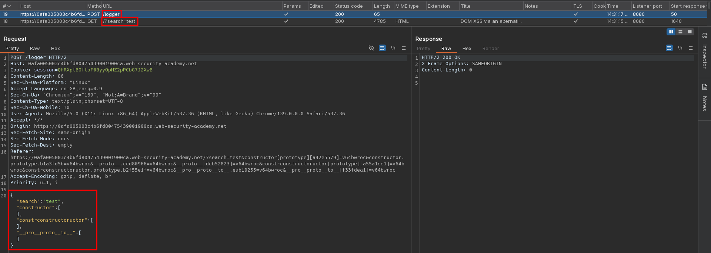
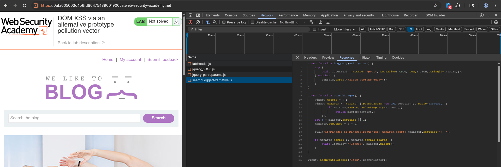
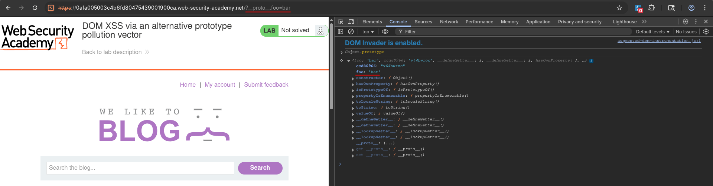
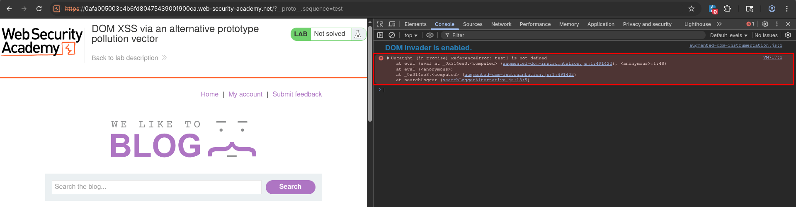
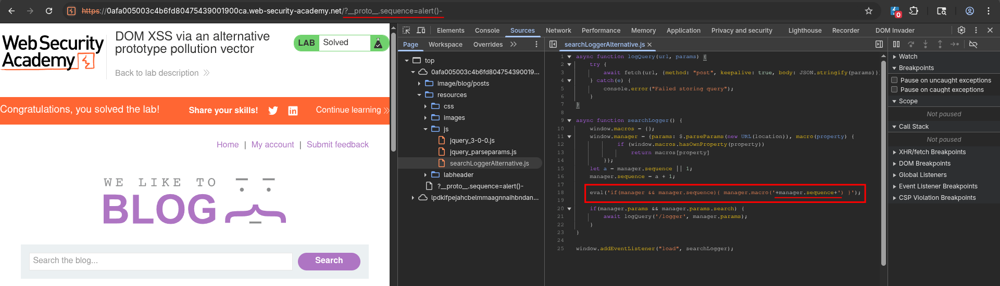
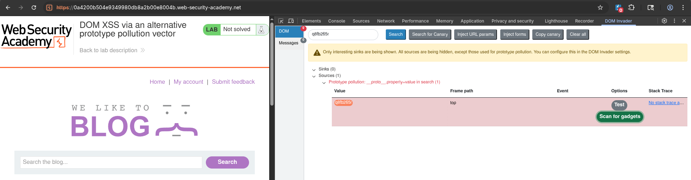
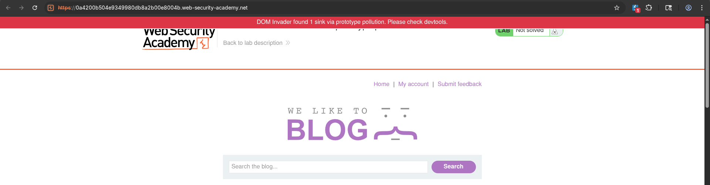
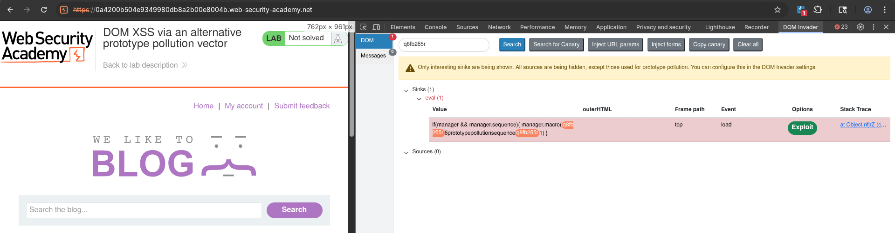
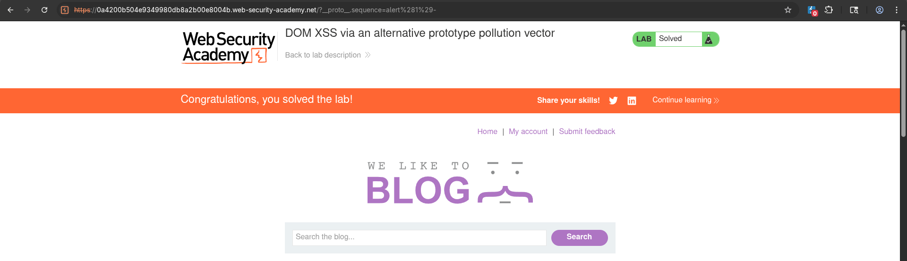

# DOM XSS via an alternative prototype pollution vector
# Objective
This lab is vulnerable to DOM XSS via client-side prototype pollution. To solve the lab:

1. Find a source that you can use to add arbitrary properties to the global `Object.prototype`.
2. Identify a gadget property that allows you to execute arbitrary JavaScript.
3. Combine these to call `alert()`.

You can solve this lab manually in your browser, or use DOM Invader to help you. 

# Solution
## Analysis
The website logs parameters send in search request.

||
|:--:|
| *Logger request with JSON data* |
||
| *Used scripts - Logger script* |

Source code of `searchLoggerAlternative.js`:
```js
async function logQuery(url, params) {
    try {
        await fetch(url, {method: "post", keepalive: true, body: JSON.stringify(params)});
    } catch(e) {
        console.error("Failed storing query");
    }
}

async function searchLogger() {
    window.macros = {};
    window.manager = {params: $.parseParams(new URL(location)), macro(property) {
            if (window.macros.hasOwnProperty(property))
                return macros[property]
        }};
    let a = manager.sequence || 1;
    manager.sequence = a + 1;

    eval('if(manager && manager.sequence){ manager.macro('+manager.sequence+') }');

    if(manager.params && manager.params.search) {
        await logQuery('/logger', manager.params);
    }
}

window.addEventListener("load", searchLogger);
```

## Exploitation
### Manual exploitation
Attacker can deliver exploit by specifying `sequence` property of `manager`, which later is executed by `eval()` - `sequence` can be used as gadget.

||
|:--:| 
| *Test for prototype pollution* |
||
| *Error in console caused by test paylod* |
||
| *Rendered script on page with final payload* |

Final payload:
```
/?__proto__.sequence=alert(1)-
```

### DOM Invader exploitation
In order to successfully exploit this prototype pollution, `-` must be add manually to the end of payload.

||
|:--:| 
| *DOM Invader - Detected sources* |
||
| *DOM Invader - Scanning for gadgets* |
||
| *DOM Invader - Scan results* |
||
| *DOM Invader - Final exploit* |
