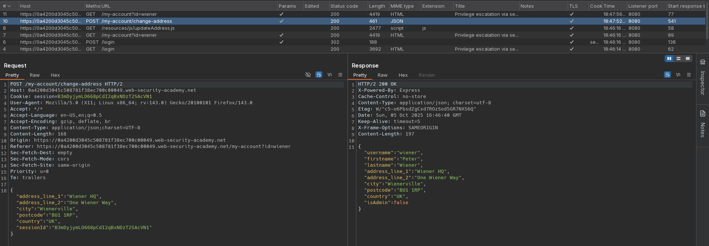
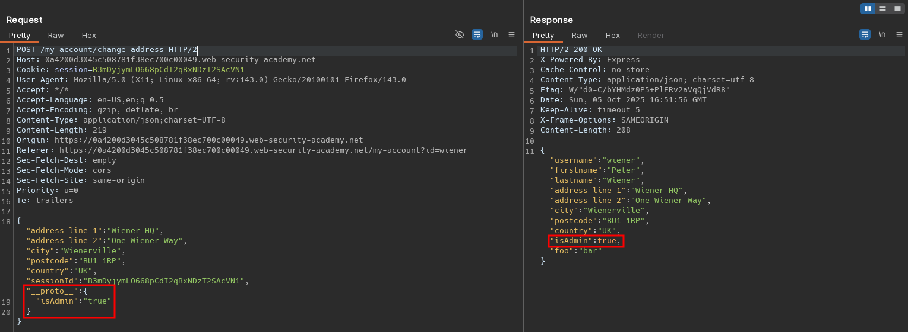
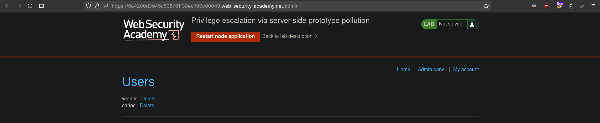

# Privilege escalation via server-side prototype pollution
# Objective
This lab is built on Node.js and the Express framework. It is vulnerable to server-side prototype pollution because it unsafely merges user-controllable input into a server-side JavaScript object. This is simple to detect because any polluted properties inherited via the prototype chain are visible in an HTTP response.

To solve the lab:

1. Find a prototype pollution source that you can use to add arbitrary properties to the global `Object.prototype`.
2. Identify a gadget property that you can use to escalate your privileges.
3. Access the admin panel and delete the user `carlos`.

You can log in to your own account with the following credentials: `wiener:peter`

# Solution
## Analysis
Endpoint `/my-account/change-address` allows given user to specify his billing and delivery address.

||
|:--:|
| *Change billing and delivery address information request* |

## Exploitation
Attacker can gain administrator privileges by polluting (modifying) `isAdmin` value.

||
|:--:| 
| *Test for prototype pollution* |
||
| *Prototype pollution - Modification of isAdmin value* |
||
| *Deletion of user carlos* |