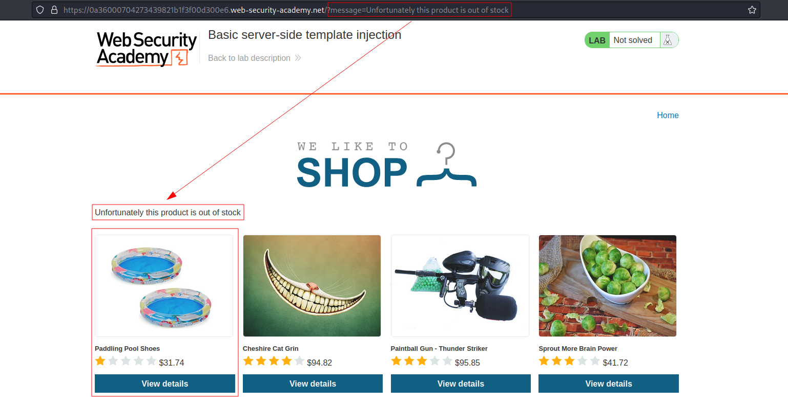
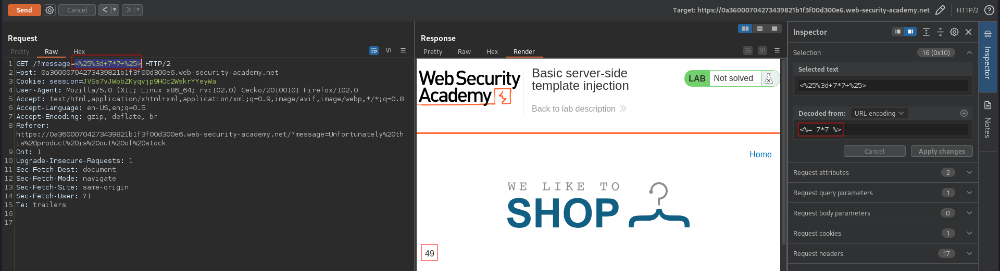
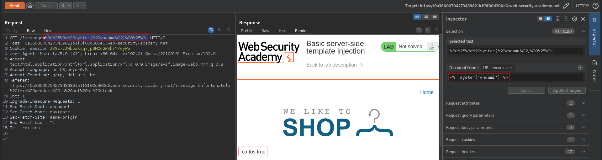
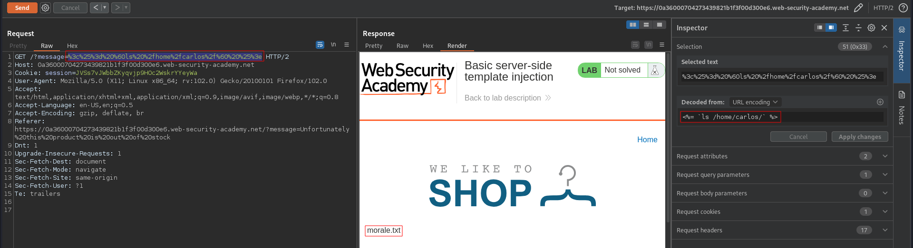
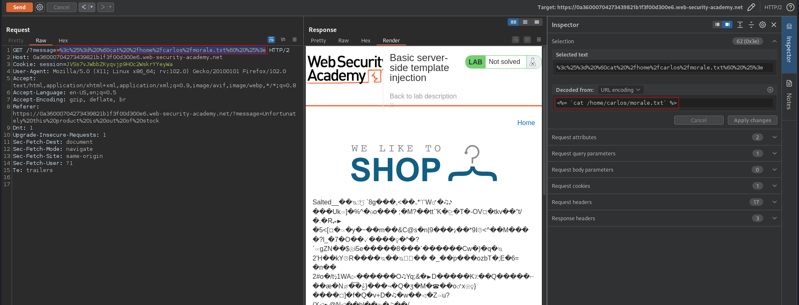
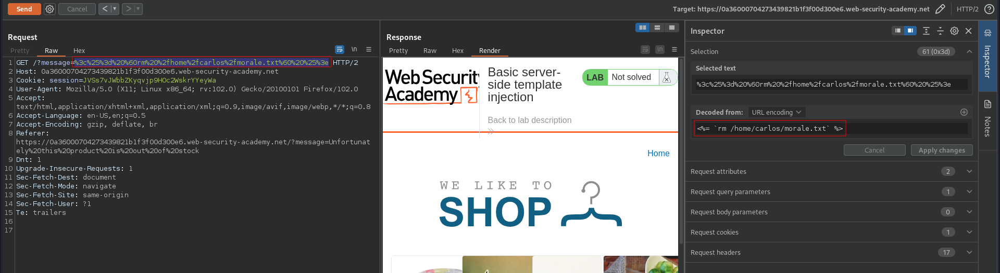

# Basic server-side template injection
# Objective
This lab is vulnerable to server-side template injection due to the unsafe construction of an `ERB` template.

To solve the lab, review the `ERB` documentation to find out how to execute arbitrary code, then delete the `morale.txt` file from Carlos's home directory.

# Solution
## Analysis
After clicking the first item, user receives information (message) that the selected item is out of stock. The description of this lab informs that there is a `ERB` template in use. The `message` parameter is vulnerable to Server-side template injection. 
||
|:--:| 
| *First item is out of stock* |
||
| *Expression was executed by template engine* |

## Exploitation

||
|:--:| 
| `whoami` command execution |
||
| `ls /home/carlos` -  List user home directory command execution |
||
| `cat /home/carlos/morale.txt` - Open file morale.txt |
||
| `rm /home/carlos/morale.txt` - Delete file morale.txt |