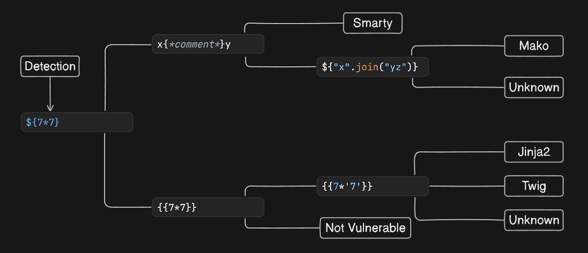

# SSTI Cheat Sheet


## Payloads
### First level
```
${7*7}
```

### Second level
```
x{*comment*}y
```
```
{{7*7}}
```

### Third level
```
${"x".join("yz")}
```
```
{{7*'7'}}
```

## FuzzString
```
${{<%[%'"}}%\
```

## Materials
[SSTI PayloadsAllTheThings](https://github.com/swisskyrepo/PayloadsAllTheThings/blob/master/Server%20Side%20Template%20Injection/README.md)
