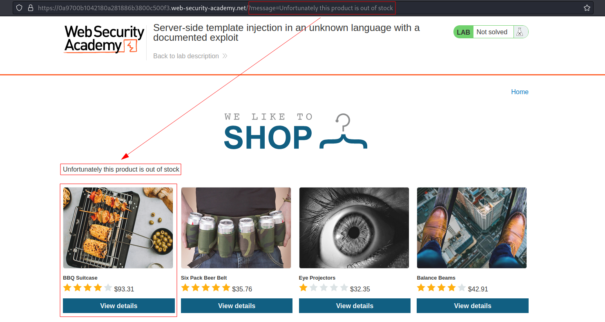
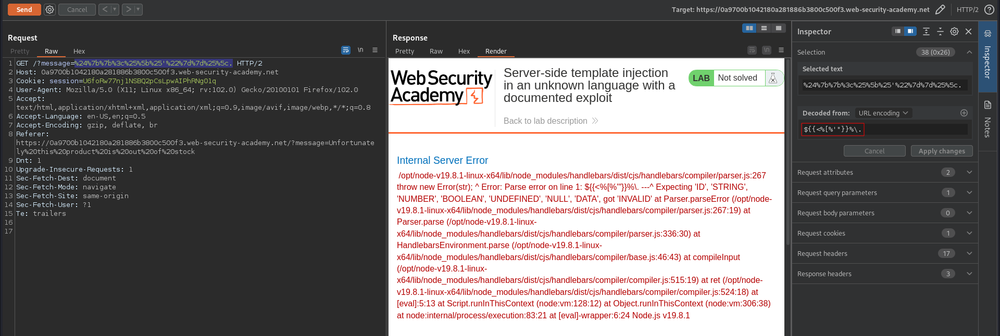
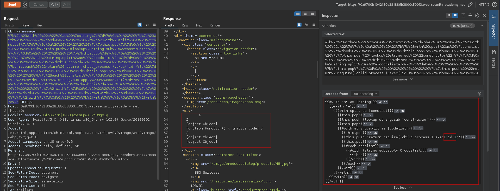
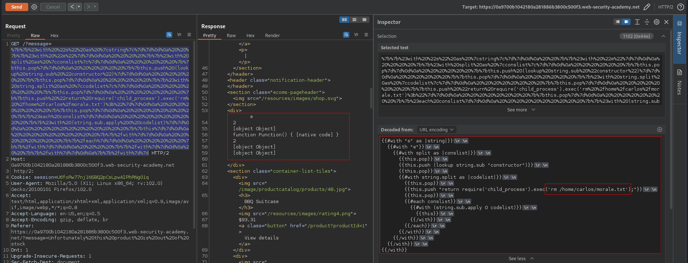

# Server-side template injection in an unknown language with a documented exploit
# Objective
This lab is vulnerable to server-side template injection. To solve the lab, identify the template engine and find a documented exploit online that you can use to execute arbitrary code, then delete the `morale.txt` file from Carlos's home directory.

# Solution
## Analysis
After clicking the first item, user receives information (message) that the selected item is out of stock. Using the fuzzstring `${{<%[%'"}}%\.` it is possible to trigger server error `HTTP 500 Internal Server Error`. The error message reveals template engine in use - `Handlebars`. 

||
|:--:| 
| *First item is out of stock* |
||
| *Fuzzstring - Handlebars is the template engine* |

## Exploitation
Link to the exploit on [HackTricks](https://book.hacktricks.xyz/) website - [Exploit](https://book.hacktricks.xyz/pentesting-web/ssti-server-side-template-injection#handlebars-nodejs)

||
|:--:| 
| *Website do not return any output* |
||
| `rm /home/carlos/morale.txt` - Delete file morale.txt |