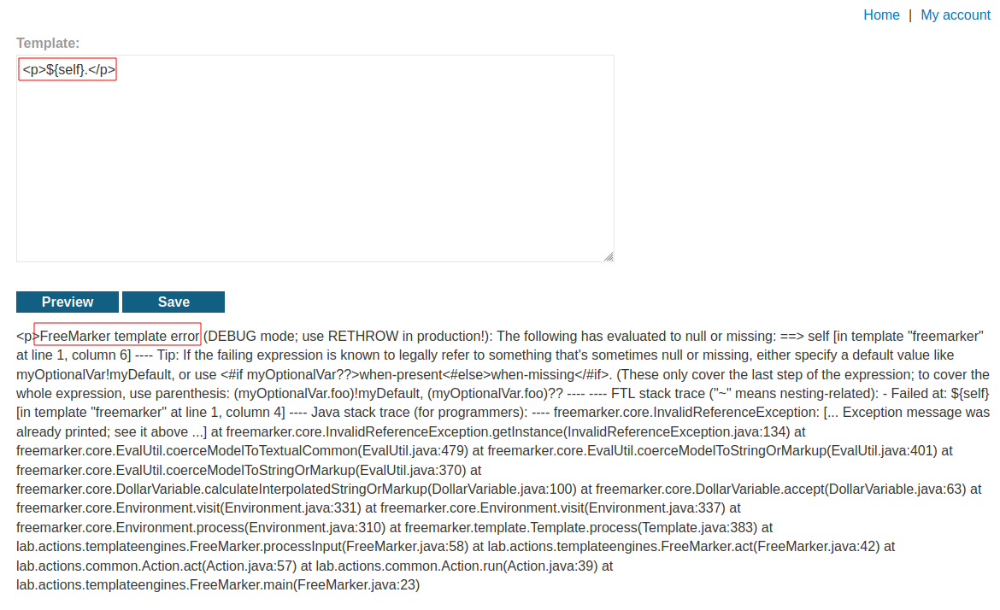
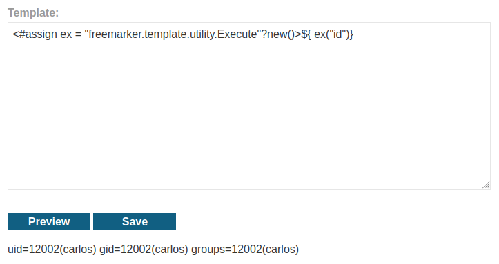
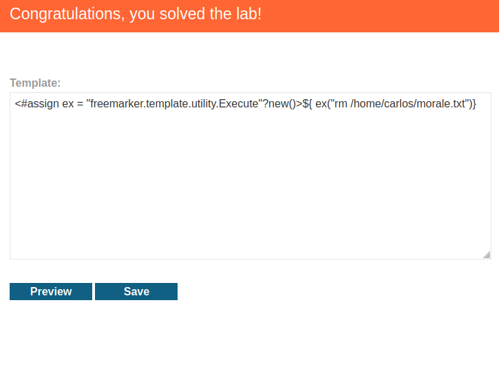

# Server-side template injection using documentation
# Objective
This lab is vulnerable to server-side template injection. 

To solve the lab, identify the template engine and use the documentation to work out how to execute arbitrary code, then delete the morale.txt file from Carlos's home directory.

You can log in to your own account using the following credentials: `content-manager:C0nt3ntM4n4g3r`

# Solution
## Analysis
The above provided credentials allow administrator to modify templates visible on the website. This website uses `FreeMarker Java Template Engine` and is vulnerable to Server-side template injection. 
||
|:--:| 
| *Modification of the template - template engine discovery* |

## Explotation
||
|:--:| 
| `id` command execution |
||
| `rm /home/carlos/morale.txt` - Delete file morale.txt |