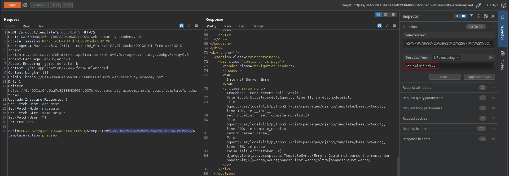
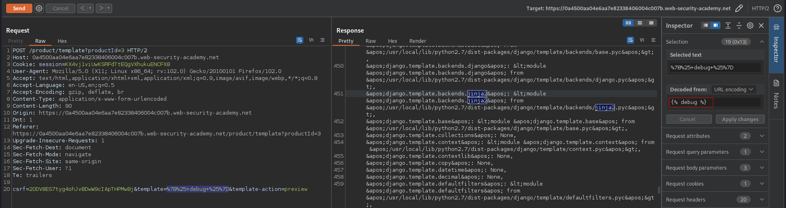
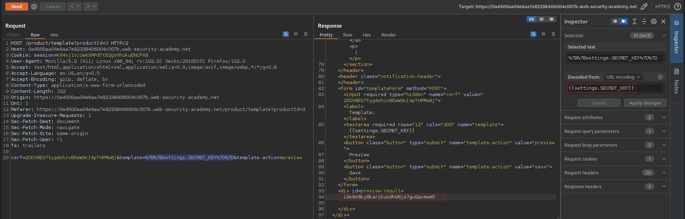

# Server-side template injection with information disclosure via user-supplied objects
# Objective
This lab is vulnerable to server-side template injection due to the way an object is being passed into the template. This vulnerability can be exploited to access sensitive data.

To solve the lab, steal and submit the framework's secret key.

You can log in to your own account using the following credentials: `content-manager:C0nt3ntM4n4g3r`

# Solution
## Analysis
The above provided credentials allow administrator to modify templates visible on the website. Using the fuzzstring `${{<%[%'"}}%\.` it is possible to trigger server error `HTTP 500 Internal Server Error`. The error message indicates that this website uses `Django` template language that supports `Jinja2` rendering engine and is vulnerable to Server-side template injection. 

||
|:--:| 
| *Modification of the template - template engine discovery* |
||
| *Modification of the template - debug information* |

## Exploitation

||
|:--:| 
| *Retrieval of framework's secret key* |