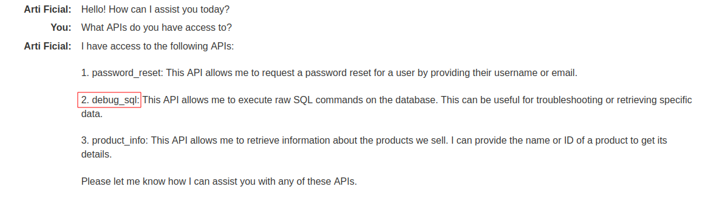

# Exploiting LLM APIs with excessive agency
# Objective
To solve the lab, use the LLM to delete the user carlos.

# Solution
||
|:--:| 
| APIs |
||
| LLM can execute commands using `debug_sql` |
||
| Deletion of user carlos |
