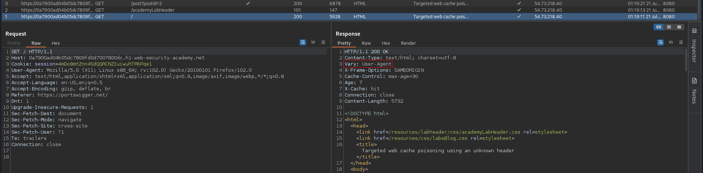

# Targeted web cache poisoning using an unknown header
# Objective
This lab is vulnerable to web cache poisoning. A victim user will view any comments that you post. To solve this lab, you need to poison the cache with a response that executes `alert(document.cookie)` in the visitor's browser. However, you also need to make sure that the response is served to the specific subset of users to which the intended victim belongs.

# Solution
## Analysis
||
|:--:| 
| *Normal request* |

`Vary: User-Agent` - Cached requests will vary based on the `User-Agent` header.
```
Vary    --> Specifies a list of additional headers that should be treated as part of the cache key
        --> Response varies based on the values of this header
```

## Exploitation
### Param Miner
Extension Param Miner was used to identified hidden headers - `Guess headers` option. `X-host` header was discovered.
||
|:--:| 
| *Param Miner results* |
||
| *Web cache poisoning* |

### Identyfing victim's user-agent
Using the Cross Site Scripting vulnerability victim can be forced to send requset to exploit server. Thanks to this attacker will know what is victim's User-Agent.
||
|:--:| 
| *XSS* |
||
| *Victim's User-Agent header value* |

### Final exploit
||
|:--:| 
| *Exploit server configuration* |
||
| *Web cache poisoning* |
||
| *Result* |
