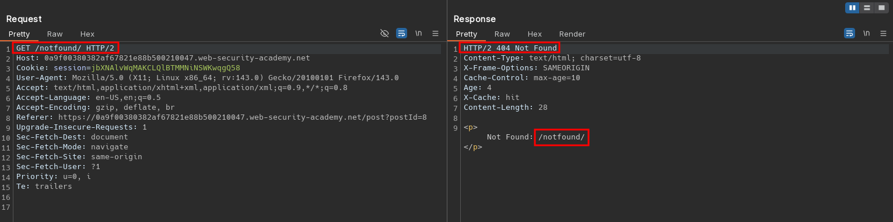

# URL normalization
# Objective
This lab contains an XSS vulnerability that is not directly exploitable due to browser URL-encoding. To solve the lab, take advantage of the cache's normalization process to exploit this vulnerability. Find the XSS vulnerability and inject a payload that will execute `alert(1)` in the victim's browser. Then, deliver the malicious URL to the victim. 

# Solution
## Analysis
Requests to static files, posts and non existing endpoints are cached.

||
|:--:| 
| *Normal request* |
||
| *Normal request to non existing endpoint* |

## Exploitation
Non existing endpoints allows to perform reflected XSS attack. Payload is in URl. By default browser URL encodes payload, therefore it does not execute. To bypass this attacker can use cache. In this case, cache key (URL) is normalized - when user makes request URL encoded request, cache normalizes URL and server attacker's payload.

||
|:--:| 
| *Cache poisoning with URL normalization* |
||
| *Browser request with XSS payload - browser encodes payload* |
||
| *Cache poisoning with URL normalization* |
||
| *Browser request with XSS payload - response served from cache after URL normalization* |
||
| *Browser request with XSS payload - response served from cache after URL normalization* |
