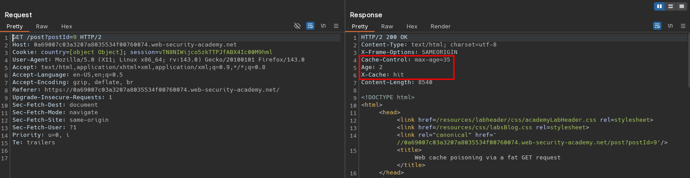
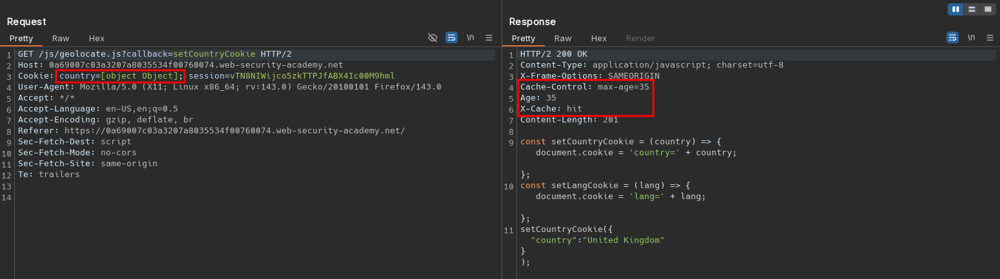
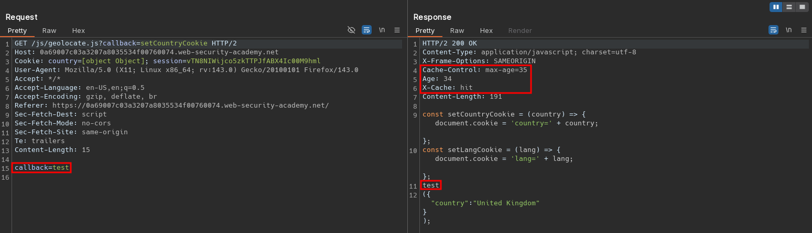
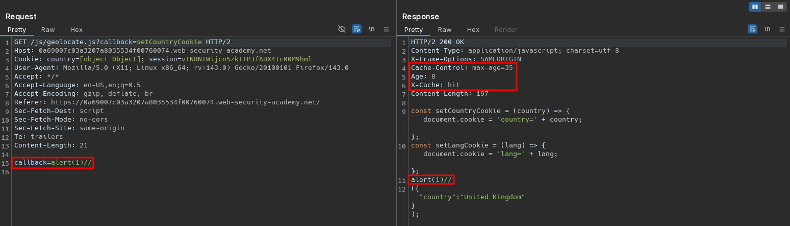

# Web cache poisoning via a fat GET request
# Objective
This lab is vulnerable to web cache poisoning. It accepts GET requests that have a body, but does not include the body in the cache key. A user regularly visits this site's home page using Chrome. To solve the lab, poison the cache with a response that executes `alert(1)` in the victim's browser. 

# Solution
## Analysis
Requests to static files and posts are cached.

||
|:--:| 
| *Normal request* |
||
| *Normal request to static file* |

## Exploitation
The website allows to send `Fat GET` request to `/js/geolocate.js`. The parameter from body ends up in response in script.

||
|:--:| 
| *Fat GET request* |
||
| *Cache poisoning via fat GET request - payload is cached* |
