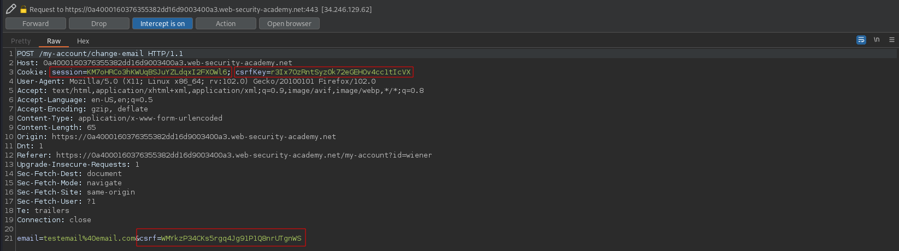
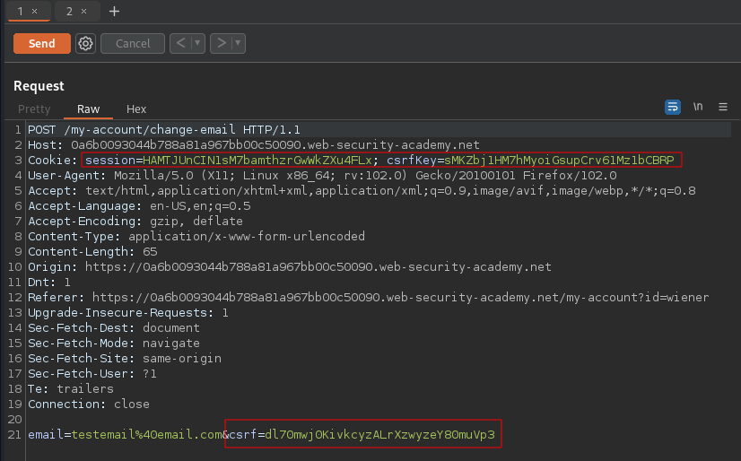
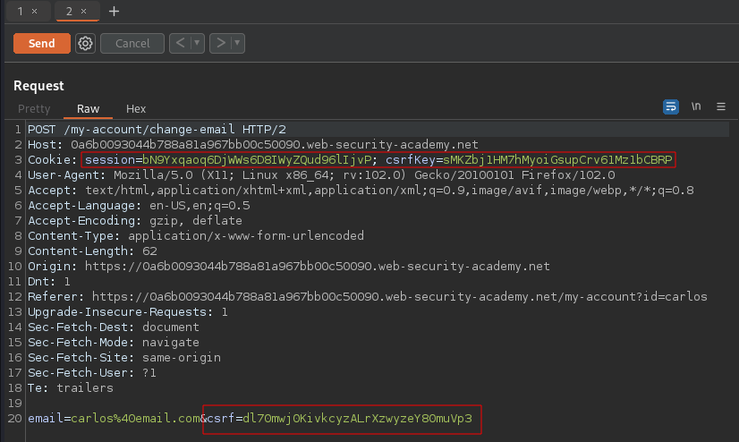
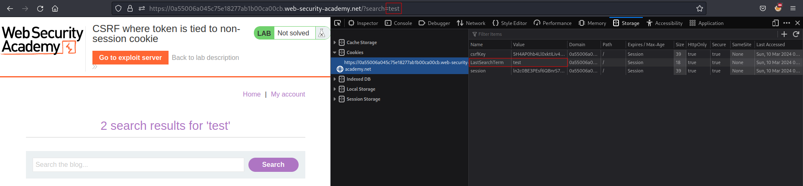
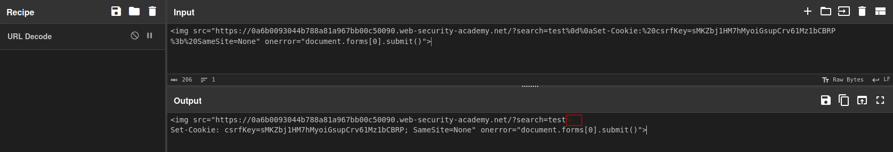
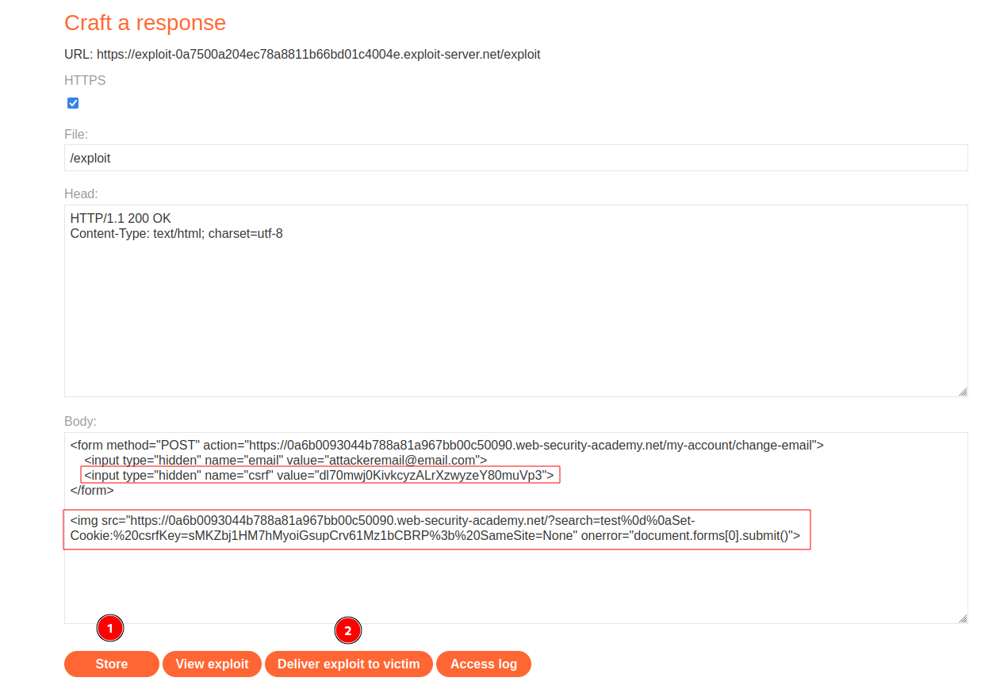

# CSRF where token is tied to non-session cookie
# Objective
This lab's email change functionality is vulnerable to CSRF. It uses tokens to try to prevent CSRF attacks, but they aren't fully integrated into the site's session handling system.To solve the lab, use your exploit server to host an HTML page that uses a CSRF attack to change the viewer's email address.\
You have two accounts on the application that you can use to help design your attack. The credentials are as follows:\
- `wiener:peter`
- `carlos:montoya`

# Solution
## Analysis

||
|:--:| 
| *Test of change email functionality (user wiener) - csrf token and csrfKey is preset* |

Both users have the same `csrf` token and `csrfKey` cookie. These security measures are not tied to user sessions.

||
|:--:| 
| *Original change email request from  wiener* |
||
| *Original change email request from  carlos* |

Moreover, latest search is stored as cookie value in user browser - search term is reflected in the Set-Cookie header.

||
|:--:| 
| *Cookie - Latest search term |

## Exploitation
In order to solve the lab the following steps must be completed:
- Craft correct payload (below)
  - Create a URL to inject your `csrfKey` cookie into the victim's browser
  - Craft POST request to `/my-account/change-email` with valid `csrf` token and valid `csrfKey` cookie
- `Store` it
- (Optional) Test it on yourselft - `View exploit`
- `Deliver exploit to victim`

URL encoded characters `%0d%0a` are `\r\n` (carriage return and line feed). They are used to seperate headers in HTTP/1.1 requests.

```html
<form method="POST" action="URL/my-account/change-email">
    <input type="hidden" name="email" value="attackeremail@email.com">
    <input type="hidden" name="csrf" value="VALID_CSRF">
</form>


```

||
|:--:| 
| *URL decoded payload* |
||
| *Exploit server configuration* |