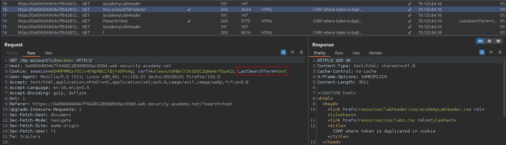
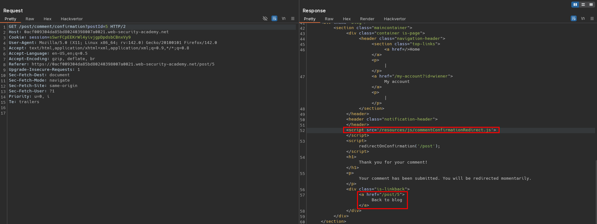

# SameSite Strict bypass via client-side redirect
# Objective
This lab's change email function is vulnerable to CSRF. \
To solve the lab, perform a CSRF attack that changes the victim's email address. You should use the provided exploit server to host your attack.\
You can log in to your own account using the following credentials: `wiener:peter`

# Solution
## Analysis
Website has `Change email` functionality which is not protected by `CSRF` token. 
There is `SameSite` option set to `Strict`, therefore browsers will ot include cookies in cross site requests. 
Both `GET` and `POST` request is possible to change email

||
|:--:| 
| *Test of change email functionality - POST request - CSRF token is not preset* |
||
| *Test of change email functionality - GET request - CSRF token is not preset* |
||
| *Cookie configuration - Samesite is set to Strict* |
||
| *Client-side redirect script* |

## Exploitation
To bypass `SameSite=Strict` attacker may use client-side open redirect. Script `commentConfirmationRedirect.js`, after 3 seconds redirects user to given port page. Data passed in URL can be modified to construct CSRF atttack and change victim's email address.

Exploit server configuration:
```html
<script>
    document.location = "https://<id>.web-security-academy.net/post/comment/confirmation?postId=../../my-account/change-email%3femail%3dattacker%2540attack.attack%26submit%3d1";
</script>
```

||
|:--:| 
| *Original request* |
||
| *Modified request - successful redirection to home page* |
||
| *Modified request - successful redirection - email address was changed* |
||
| *Exploit server configuration* |
