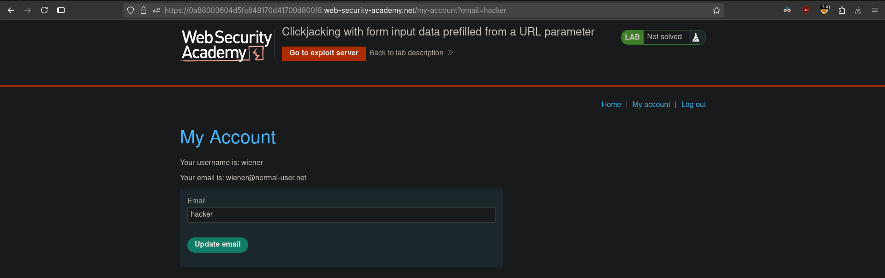

# Clickjacking with form input data prefilled from a URL parameter
# Objective
This lab extends the basic clickjacking example in Lab: [Basic clickjacking with CSRF token protection](./Basic_clickjacking_with_CSRF_token_protection.md). The goal of the lab is to change the email address of the user by prepopulating a form using a URL parameter and enticing the user to inadvertently click on an "Update email" button.

To solve the lab, craft some HTML that frames the account page and fools the user into updating their email address by clicking on a "Click me" decoy. The lab is solved when the email address is changed.

You can log in to your own account using the following credentials: `wiener:peter` 

# Solution
## Analysis
Website allows for prepopulation of `email` field using parameter in `GET` request.

||
|:--:| 
| *Prepopulation of email field via GET parameter* |

## Exploitation

||
|:--:| 
| *Target - Change email button* |
||
| *Review of recorded attack* |
