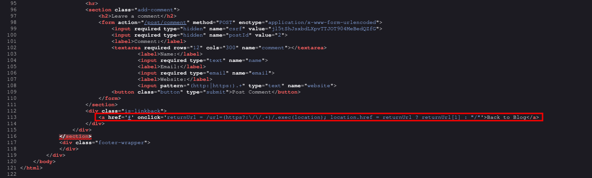

# DOM-based open redirection
# Objective
This lab contains a DOM-based open-redirection vulnerability.\
To solve this lab, exploit this vulnerability and redirect the victim to the exploit server.

# Solution
## Analysis
Website has `Go back` functionality that redirects to home page.

||
|:--:| 
| *Open redirect vulnerability* |

## Exploitation
Following sinks can lead to DOM-based open-redirection:
```
location
location.host
location.hostname
location.href
location.pathname
location.search
location.protocol
location.assign()
location.replace()
open()
element.srcdoc
XMLHttpRequest.open()
XMLHttpRequest.send()
jQuery.ajax()
$.ajax()
```

Attacker can create following malicious link that can redirect victim to other websites:
```js
https://<id>.net/post?postId=2&url=https://<id>.exploit-server.net/
```
