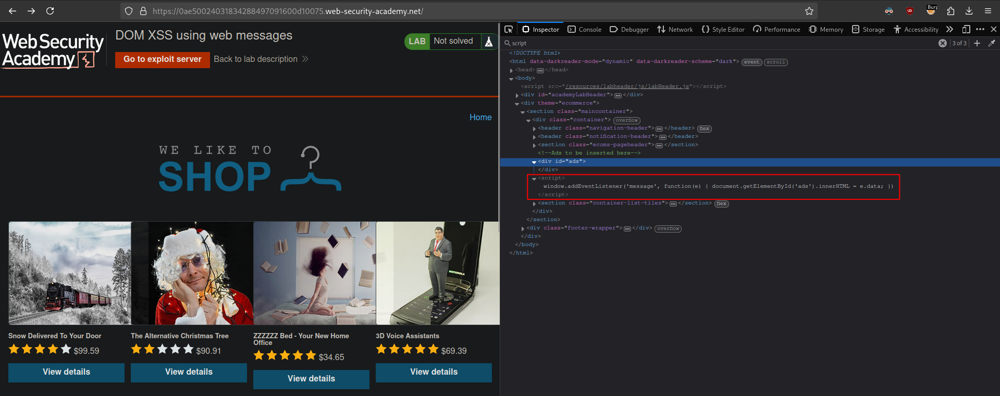
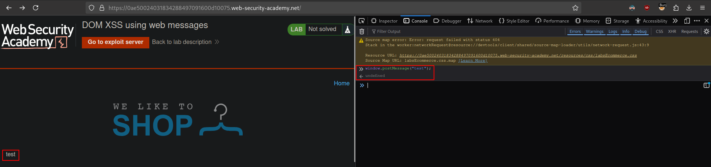
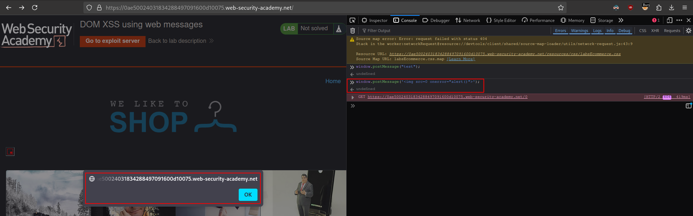
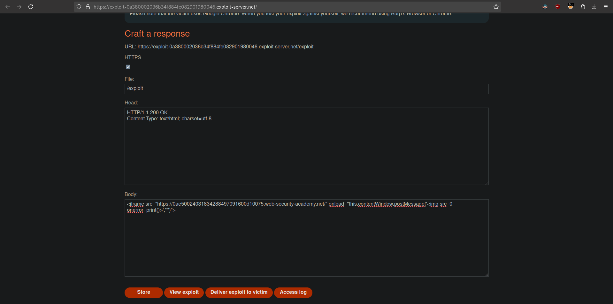

# DOM XSS using web messages
# Objective
This lab demonstrates a simple web message vulnerability. To solve this lab, use the exploit server to post a message to the target site that causes the `print()` function to be called.

# Solution
## Analysis
Website has `script` that creates `eventListener`  prepared for `ads`.

||
|:--:| 
| *Added event listener - Web messages* |

Vulnerable code:
```js
<script>
    window.addEventListener('message', function(e) {
        document.getElementById('ads').innerHTML = e.data;
    })
</script>
```

## Exploitation

||
|:--:| 
| *Testing* |
||
| *Testing basic XSS - provided payload was executed* |
||
| *Final payload* |

Final payload:
```js
<iframe src="https://0ae50024031834288497091600d10075.web-security-academy.net/" onload="this.contentWindow.postMessage('','*')">
```


Explaination:
- `this` - refers to `iframe`.
- `contentWindow` - refers to window object of the `iframe`.
- `postMessage()` - calls web message method.
- `'*'` - specifies the `targetOrigin` - the origin the recipient window must have in order to receive the event. In order for the event to be dispatched, the origin must match exactly. `*` is a wildcard.


