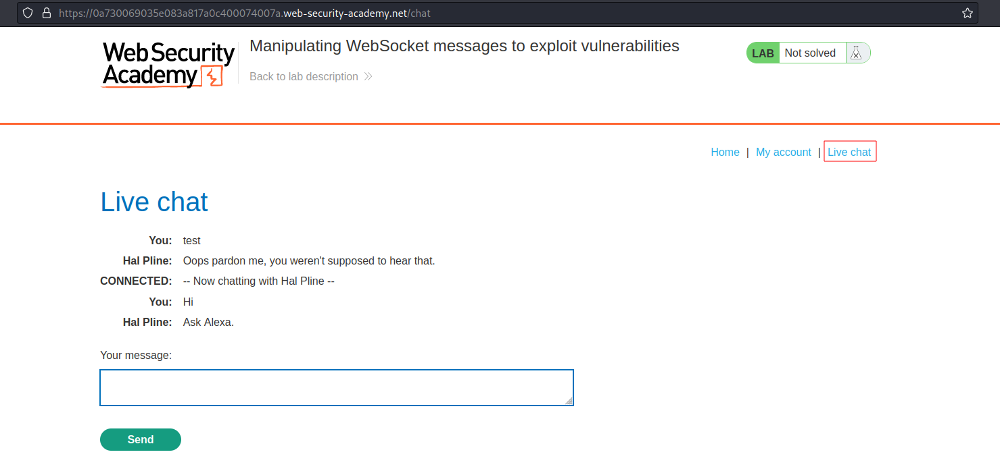
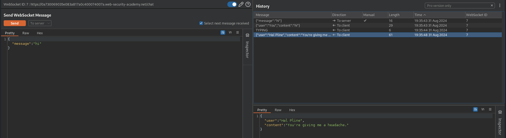
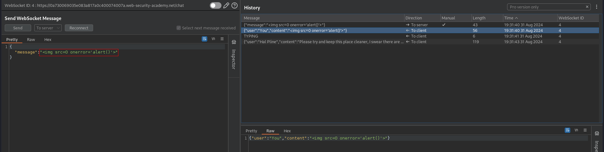
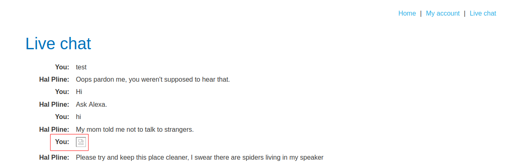

# Manipulating WebSocket messages to exploit vulnerabilities
# Objective
This online shop has a live chat feature implemented using WebSockets.\
Chat messages that you submit are viewed by a support agent in real time.\
To solve the lab, use a WebSocket message to trigger an `alert()` popup in the support agent's browser.


# Solution
## Analysis
On the website there is a live chat feature implemented using WebSockets.
||
|:--:| 
| *Chat functionality* |
||
| *Websocket view from repeater* |

## Exploitation
Payload:
```json
{"message":""}
```
||
|:--:| 
| *Successful XSS payload* |
||
| *Result - alert popup* |

In order to complete the lab payload needs to be injected into intercepted packet.
