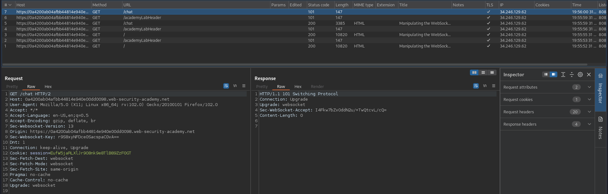
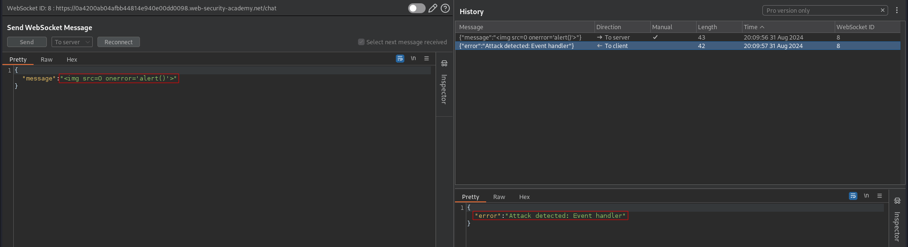
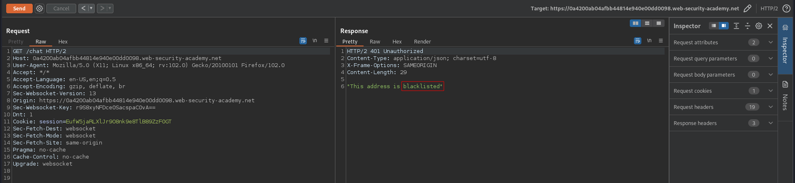
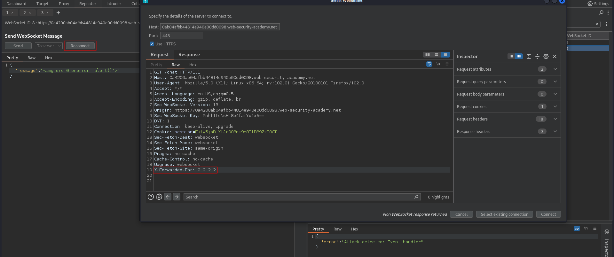
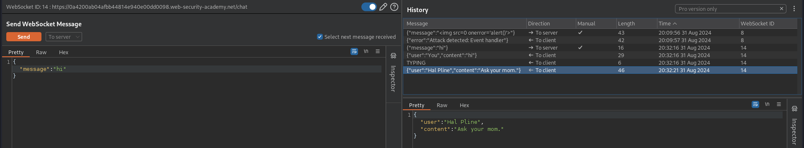
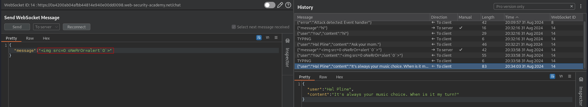

# Manipulating the WebSocket handshake to exploit vulnerabilities
# Objective
This online shop has a live chat feature implemented using WebSockets.

It has an aggressive but flawed XSS filter.

To solve the lab, use a WebSocket message to trigger an `alert()` popup in the support agent's browser.

# Solution
## Analysis
On the website there is a live chat feature implemented using WebSockets. 
||
|:--:| 
| *WebSocket handshake* |

## Exploitation
Basic XSS attack attempts are detected. After attempt attacker IP in blacklisted.

||
|:--:| 
| *Failed XSS attack attempt* |
||
| *Attacker IP address is blacklisted* |

Blacklist can be bypassed using `X-Forwarded-For` header.
||
|:--:| 
| *Blacklist bypass* |
||
| *Result - chat works again* |

Using the following payload it is possible to bypass XSS filter:
```json
{"message":""}
```
||
|:--:| 
| *Successful XSS payload* |